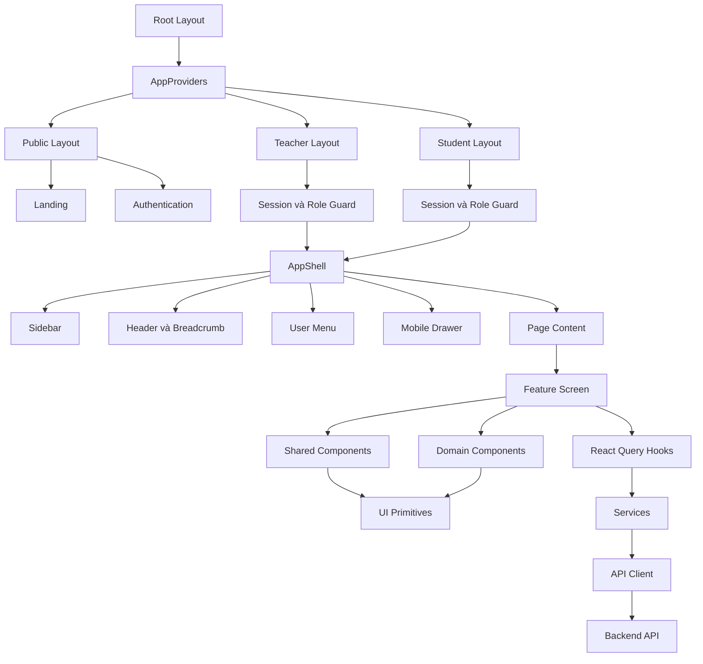
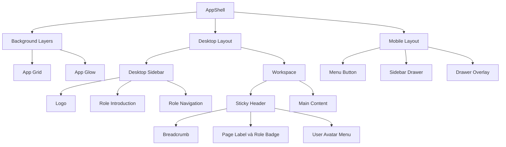
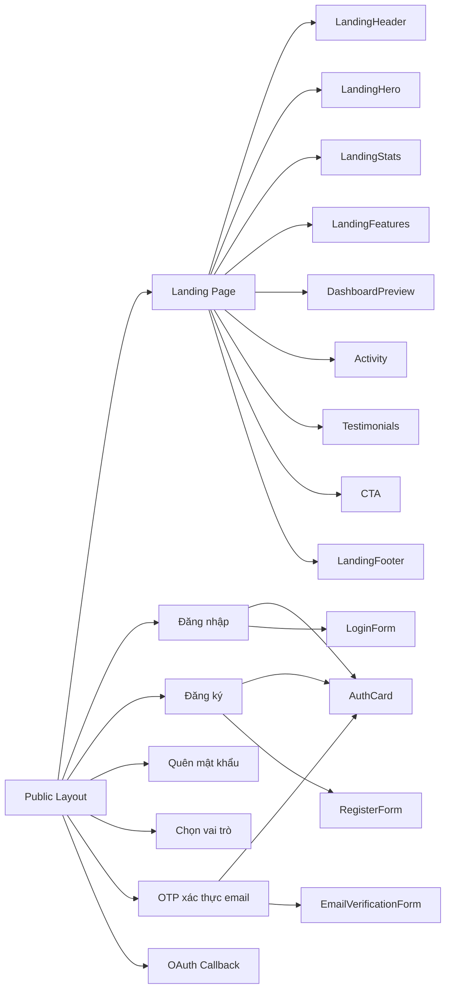
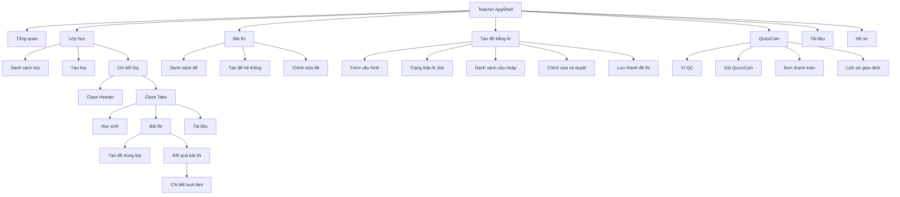
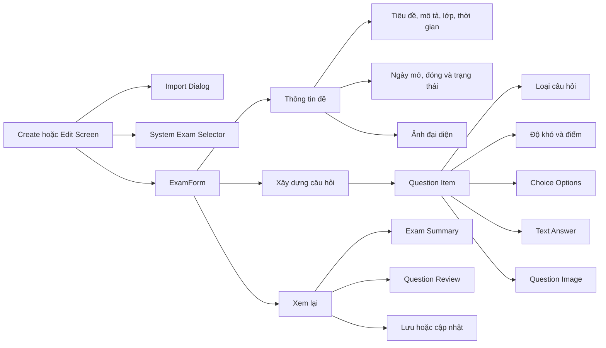
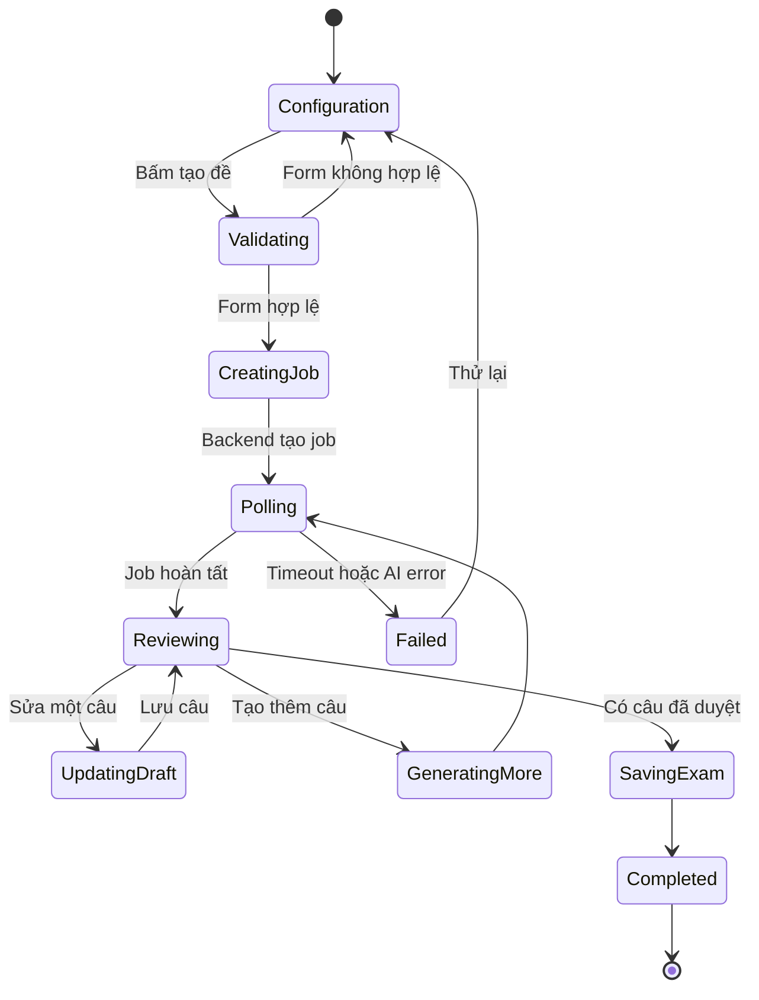
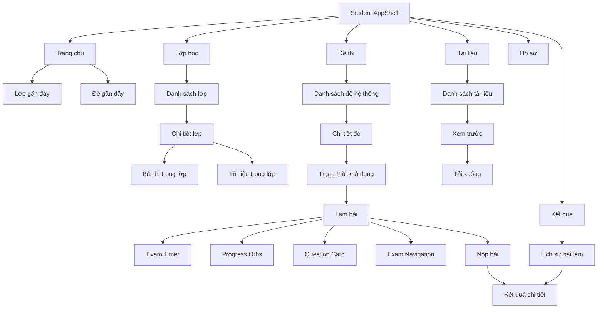
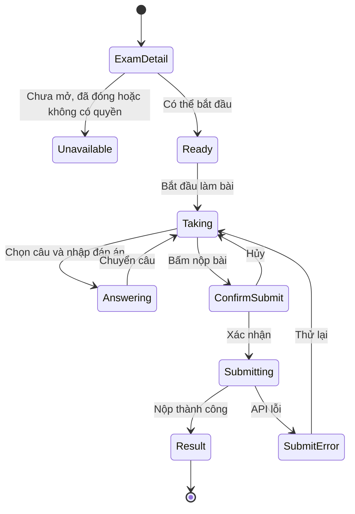
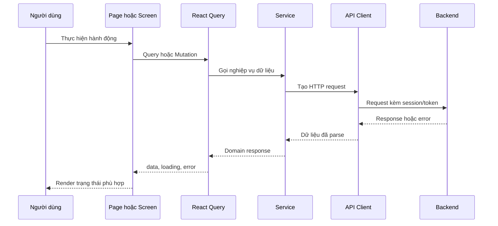

# QuizzVN Frontend - Component Breakdown cho UI/UX

> Cập nhật: 22/07/2026  
> Phạm vi: frontend Next.js trong repository `quizz-fe`  
> Mục tiêu: làm bản đồ hiện trạng để thiết kế, kiểm tra và chuẩn hóa UI/UX.

## 1. Tổng quan kiến trúc

Frontend đang sử dụng Next.js App Router. Ứng dụng được chia thành ba vùng trải nghiệm chính:

1. Public và Authentication.
2. Student workspace.
3. Teacher workspace.

Teacher và Student sử dụng chung một `AppShell`. Mỗi route render một page hoặc screen component; screen gọi React Query hooks hoặc service để lấy dữ liệu từ backend.



## 2. Phân tầng component

| Tầng | Vị trí | Trách nhiệm |
| --- | --- | --- |
| Root | `app/layout.tsx` | Font, metadata, CSS toàn cục và provider |
| Provider | `app/providers.tsx` | React Query, auth event và analytics |
| Role layout | `app/(teacher)/layout.tsx`, `app/(student)/layout.tsx` | Kiểm tra session, onboarding và role |
| Application shell | `components/shared/app-shell.tsx` | Sidebar, header, breadcrumb, user menu, mobile navigation |
| Route entry | `app/**/page.tsx` | Điểm vào URL, đọc route params và search params |
| Feature screen | `components/features/*`, một số file trong route | Điều phối toàn bộ một nghiệp vụ hoặc màn hình |
| Domain component | `components/exams/*`, `components/features/*` | UI dành riêng cho bài thi, tài liệu, lớp học, AI và billing |
| Shared composition | `components/shared/*` | Hero, stat, panel, empty state và breadcrumb helpers |
| UI primitive | `components/ui/*` | Button, input, select, dialog, badge, toast và các control cơ bản |
| State và query | `hooks/*`, `hooks/queries/*` | Query key, fetch state, cache và mutation |
| Data access | `services/*`, `lib/api/*` | Gọi API, xử lý token và lỗi HTTP |
| Mapper và utility | `lib/*` | Chuyển đổi payload, format và business helper phía frontend |
| Shared types | `types/*`, `lib/api/types.ts` | Contract dữ liệu dùng trong frontend |

## 3. AppShell hiện tại

`AppShell` là source of truth cho toàn bộ khu vực đã đăng nhập của Teacher và Student.



### Teacher navigation

```text
Teacher
├── Tổng quan             /teacher
├── Lớp học               /teacher/classes
├── Bài thi               /teacher/exams
├── QuizzCoin             /teacher/billing
├── Tài liệu              /teacher/documents
└── Hồ sơ                 /teacher/profile
```

### Student navigation

```text
Student
├── Trang chủ             /student
├── Đề thi                /student/exams
├── Lớp học               /student/classes
├── Kết quả               /student/results
├── Tài liệu              /student/materials
└── Hồ sơ                 /student/profile
```

## 4. Public và Authentication



### Component chính

- `features/auth/components/AuthCard.tsx`
- `features/auth/components/LoginForm.tsx`
- `features/auth/components/RegisterForm.tsx`
- `features/auth/components/RoleSelectionForm.tsx`
- `features/auth/components/EmailVerificationForm.tsx`
- `features/auth/components/AuthCallbackRedirect.tsx`
- `components/features/landing/*`

## 5. Teacher workspace



### 5.1. Dashboard giáo viên

```text
Teacher Dashboard
├── Welcome Hero
├── Quick Actions
│   ├── Tạo lớp
│   ├── Tạo đề
│   └── Đăng tài liệu
├── Statistics
├── Lớp học gần đây
├── Bài thi gần đây
└── Tài liệu gần đây
```

### 5.2. Quản lý lớp học

```text
Class List
├── Page heading
├── Create class action
├── Loading / Error / Empty states
└── Class rows hoặc cards
    ├── Class information
    ├── Student count
    ├── Exam count
    ├── Document count
    ├── Join code
    └── Row actions

Class Detail
├── Back navigation
├── ClassHeader
│   ├── Class information
│   ├── Add document
│   ├── Edit classroom dialog
│   └── Delete classroom dialog
└── ClassTabs
    ├── StudentsTab
    │   ├── StudentTable
    │   └── RemoveStudentDialog
    ├── ExamsTab
    │   └── ExamTable
    └── DocumentsTab
        └── DocumentTable
```

### 5.3. Tạo và chỉnh sửa đề thi

`ExamForm` là component điều phối chung cho đề hệ thống và đề trong lớp.



Các loại câu hỏi frontend đang xử lý:

1. Trắc nghiệm.
2. Đúng hoặc sai.
3. Trả lời ngắn.
4. Tự luận.

### 5.4. Tạo đề bằng AI



```text
TeacherAIExamScreen
├── AIGenerateForm
│   ├── Scope và lớp học
│   ├── Bối cảnh đề
│   ├── Thời lượng
│   ├── Tổng số câu
│   ├── Phân bổ loại câu
│   └── Phân bổ độ khó
├── QC Cost Summary
├── AI Job Status
├── Generate More Controls
├── AIQuestionDraftCard
│   ├── Nội dung câu hỏi
│   ├── Loại câu
│   ├── Độ khó
│   ├── Điểm
│   ├── Đáp án
│   ├── Giải thích
│   └── Trạng thái duyệt
├── Question Navigator
├── Recent Drafts
└── AISavePanel
```

### 5.5. QuizzCoin và thanh toán

```text
TeacherBillingScreen
├── Page heading + Refresh
├── Wallet summary
│   ├── QC balance
│   ├── Premium status
│   └── Free daily questions
├── Billing plans
│   └── PlanCard
├── Payment orders table
├── QC transactions table
├── PaymentOrderDialog
└── Toast feedback
```

### 5.6. Tài liệu giáo viên

```text
Teacher Documents
├── Page heading
├── Create document action
├── DocumentFilterBar
├── TeacherDocumentList
│   ├── DocumentCard
│   └── DocumentContextMenu
├── Upload/Create screen
└── DeleteConfirmDialog
```

### 5.7. Kết quả bài thi

```text
Exam Results
├── Exam summary
│   ├── Lượt nộp
│   ├── Số học sinh đạt
│   └── Điểm trung bình
├── Export Excel action
├── Student result table
│   ├── Học sinh
│   ├── Điểm
│   ├── Câu đúng
│   ├── Thời gian nộp
│   ├── Trạng thái
│   └── Chi tiết
└── Attempt Detail
    ├── Student summary
    ├── Score summary
    └── Question result breakdown
```

## 6. Student workspace



### 6.1. Luồng làm bài thi



```text
Take Exam Page
├── ExamTimer
├── ProgressOrbs
├── QuestionCard
│   ├── Question content
│   ├── Question image
│   └── AnswerOption
├── ExamNavigation
└── Submit confirmation
```

### 6.2. Tài liệu học sinh

```text
Student Materials
├── PageHero
├── Metrics
├── Search và sort
├── DocumentList
│   └── DocumentCard
├── DocumentViewer
│   ├── PDF preview
│   ├── Image preview
│   ├── Text preview
│   └── Unsupported fallback
├── Download button
└── Toast feedback
```

## 7. Hồ sơ dùng chung

Teacher và Student cùng sử dụng `UserInfoPage` và `ProfilePage`, chỉ thay đổi nội dung theo role.

```text
ProfilePage
├── Profile Hero
├── Avatar Upload Card
├── Account Tabs
│   ├── Tài khoản
│   │   ├── Vai trò
│   │   ├── Tên đăng nhập
│   │   ├── Email
│   │   └── Số điện thoại
│   └── Mật khẩu
│       ├── Mật khẩu hiện tại
│       ├── Mật khẩu mới
│       └── Nhập lại mật khẩu
├── Save actions
├── Loading state
├── Error state
└── Toast feedback
```

## 8. Shared components và UI primitives

### Shared composition

| Component | Vai trò UI/UX |
| --- | --- |
| `AppShell` | Khung điều hướng toàn ứng dụng |
| `PageHero` | Tiêu đề, mô tả, action và metrics đầu trang |
| `StatCard` | Hiển thị chỉ số |
| `SurfacePanel` | Khối nội dung bề mặt dùng chung |
| `AppEmptyState` | Trạng thái chưa có dữ liệu |
| Breadcrumb helpers | Nhãn breadcrumb động theo dữ liệu route |

### UI primitives

```text
components/ui
├── AlertDialog
├── Avatar
├── Badge
├── Button
├── Card
├── Checkbox
├── Dialog
├── DropdownMenu
├── Input
├── Label
├── Popover
├── RadioGroup
├── Select
├── Skeleton
├── Textarea
├── Toast
└── Tooltip
```

### Form controls dùng chung

```text
components/common/form
├── Input
├── Select
├── Textarea
├── Checkbox
├── Radio
├── DatePicker
└── DateTimePicker
```

## 9. Design foundations hiện tại

### Typography

- Display và heading: Manrope.
- Body và control: Public Sans.

### Màu chính

| Token | Giá trị light mode | Công dụng chính |
| --- | --- | --- |
| Primary | `#4f46e5` | Action chính, active state |
| Secondary | `#0891b2` | Accent bổ trợ |
| Tertiary | `#7c3aed` | Accent thứ ba và AI-related UI |
| Background | `#f5f7ff` | Nền ứng dụng |
| Foreground | `#0f172a` | Nội dung chính |
| Surface lowest | `#ffffff` | Panel và form surface |

Theme cũng có dark-mode tokens trong `app/globals.css`.

### Visual pattern đang sử dụng

- Nền sáng với grid nhẹ và glow.
- Panel trắng hoặc trắng trong suốt.
- Border mờ.
- Shadow mềm.
- Lucide icons.
- Primary indigo, secondary cyan và tertiary violet.
- Responsive breakpoint theo mobile, tablet và desktop.

## 10. Luồng dữ liệu và trạng thái



Mỗi màn hình cần thiết kế đủ các state sau:

1. Initial loading.
2. Background refresh.
3. Empty data.
4. Partial data.
5. Validation error.
6. API error.
7. Permission denied.
8. Disabled hoặc unavailable.
9. Mutation in progress.
10. Success confirmation.

## 11. Cấu trúc Figma đề xuất

```text
00 Cover & Documentation
01 Foundations
│   ├── Color tokens
│   ├── Typography
│   ├── Spacing
│   ├── Radius
│   ├── Shadow
│   └── Iconography
├── 02 UI Primitives
│   ├── Buttons
│   ├── Inputs
│   ├── Selects
│   ├── Checkboxes và radios
│   ├── Badges
│   ├── Dialogs
│   ├── Toasts
│   └── Tooltips
├── 03 Shared Components
│   ├── AppShell
│   ├── Sidebar
│   ├── Header và breadcrumb
│   ├── PageHero
│   ├── SurfacePanel
│   ├── StatCard
│   ├── Table
│   └── Empty, loading và error states
├── 04 Page Templates
│   ├── Dashboard
│   ├── List và filter
│   ├── Detail và tabs
│   ├── Multi-step form
│   ├── Data table
│   └── Exam workspace
├── 05 Teacher Screens
│   ├── Dashboard
│   ├── Classes
│   ├── Exams
│   ├── AI Exam
│   ├── Billing
│   ├── Documents
│   ├── Results
│   └── Profile
├── 06 Student Screens
│   ├── Home
│   ├── Classes
│   ├── Exams
│   ├── Take Exam
│   ├── Results
│   ├── Materials
│   └── Profile
├── 07 Authentication
│   ├── Login
│   ├── Register
│   ├── OAuth
│   ├── OTP
│   └── Role selection
└── 08 Responsive & States
    ├── Desktop
    ├── Tablet
    ├── Mobile
    ├── Loading
    ├── Empty
    ├── Error
    └── Success
```

## 12. Quy tắc dùng tài liệu khi thiết kế

1. Thiết kế `Foundations` và `UI Primitives` trước.
2. Dựng một `AppShell` duy nhất rồi tạo variant Teacher và Student.
3. Dùng page template cho các trang có cấu trúc giống nhau.
4. Tách trạng thái khỏi màn hình mặc định, không chỉ thiết kế happy path.
5. Mọi action nguy hiểm cần dialog xác nhận.
6. Mọi API mutation cần loading, success và error feedback.
7. Các bảng dữ liệu phải có responsive strategy, không chỉ co nhỏ desktop table.
8. Giữ navigation và breadcrumb thống nhất với route map trong tài liệu này.
9. Không thiết kế dựa trên các `Header` hoặc `Sidebar` cũ nếu chúng không được `AppShell` sử dụng.
10. Khi thay đổi route hoặc feature lớn, cập nhật lại sơ đồ tương ứng.

## 13. Lưu ý về cấu trúc source hiện tại

Hiện tại feature được đặt ở hai khu vực:

- `components/features/*`: phần lớn nghiệp vụ Teacher, Student, landing, exam và document.
- `features/*`: authentication và account/profile.

Ngoài ra, một số feature riêng của route được đặt trực tiếp trong `app`, ví dụ chi tiết lớp và màn hình tạo đề theo lớp. Đây là hiện trạng cần phản ánh trong tài liệu, nhưng không nên tạo thêm một hệ component song song khi thiết kế UI mới.

Source of truth ưu tiên cho UI/UX:

1. `components/shared/app-shell.tsx` cho navigation và layout.
2. `app/globals.css` cho design tokens.
3. `components/ui/*` cho primitive controls.
4. `components/shared/*` cho composition dùng chung.
5. Feature screen thực tế cho flow và trạng thái nghiệp vụ.

