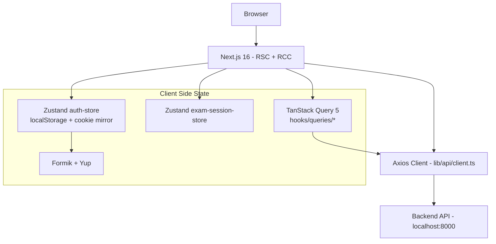
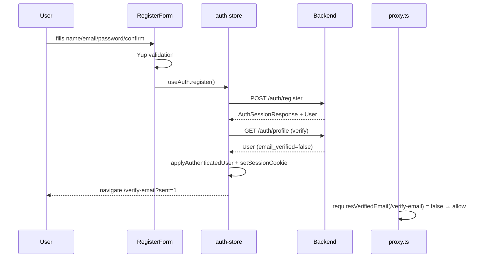
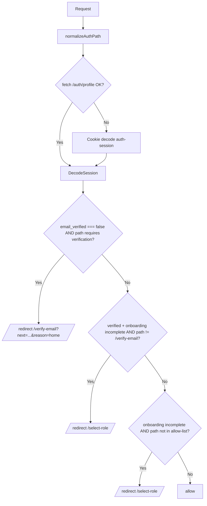
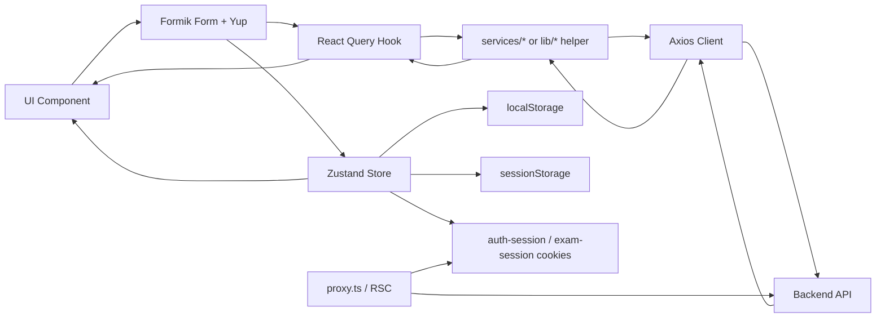
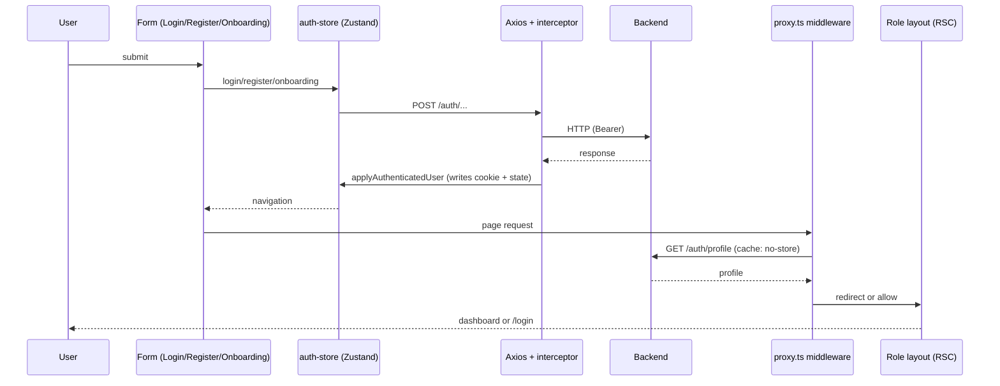
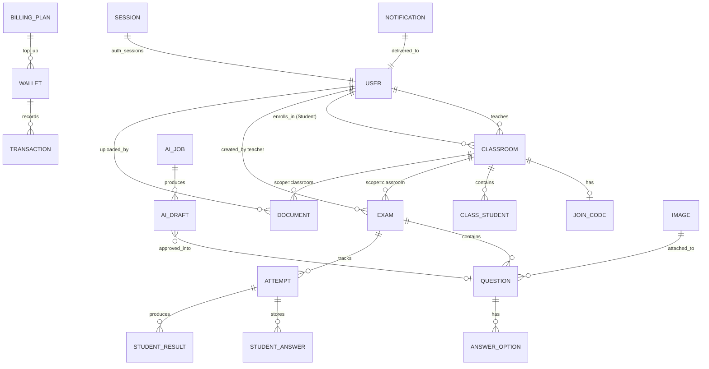

# Quizz-FE Comprehensive Documentation

> QuizzVN — Online quiz/exam platform for Vietnamese students and teachers.
> Next.js 16.2.3 (App Router, RSC) · React 19 · TypeScript · Tailwind v4 · shadcn/ui (radix-nova) · TanStack Query 5 · Zustand 5 · Formik + Yup · Axios · framer-motion.
> Source: comprehensive scout of `/Users/te-member/Projects/quizz-fe` (Oct/Nov 2025 → July 2026 codebase snapshot).

---

## 1. Website Overview

### Purpose
QuizzVN is an online quiz/exam platform enabling Vietnamese teachers to author, distribute, and grade assessments, and Vietnamese students to take exams, review results, and access study materials. The product supports classroom-scoped and system-wide exam repositories, AI-assisted exam generation, document upload/viewing, and a QuizzCoin-based billing model.

### Target Users
| Role | Profile |
|---|---|
| **Student** | Vietnamese student (grades 6–12) — joins classes, takes exams, views results, downloads study materials. |
| **Teacher** | Vietnamese teacher — creates classes, authors/edits exams, uploads documents, generates AI exams, manages billing. |

### Business Objectives
1. **Authoring & delivery** — provide teachers a multi-step exam builder (general info, question builder, review) plus an AI exam generation flow.
2. **Classroom model** — enforce class-scoped access via join codes; assignment/grading per class.
3. **Repository model** — keep a system-wide exam & document repository (`scope: "system"`) for all teachers/students.
4. **Monetization** — QuizzCoin wallet + plans + payment orders + transactions for AI exam generation.
5. **Learning analytics** — student dashboard surfaces metrics, 7-day activity chart, subject progress, recommended exams.

### Inferred Architecture
- **Frontend-only Next.js app** consuming an external HTTP API at `NEXT_PUBLIC_API_URL` (default `http://localhost:8000`); server-side uses `API_URL`.
- **Server-side rendered (RSC) layouts** for auth/onboarding/role gating; **client components** for interactive screens.
- **Two auth read paths**: (1) Zustand `auth-store` (persisted in localStorage, mirrors a base64 `auth-session` cookie so RSC can read it); (2) Axios `Bearer` token loaded from the same `auth-session` cookie via `lib/api/token-client.ts#getToken`.
- **Hybrid data layer**: SSR via `getServerSession` (cookie decode + live `/auth/profile` fallback) + CSR React Query for live data + Zustand for in-progress exam session.
- **API error normalization** at `lib/api/client.ts:normalizeError` → custom `ApiError { detail, message, code?, status, details? }` → `lib/api/error-message.ts:getApiErrorMessage(err, fallback)` for UI display.
- **axios global**: `baseURL = NEXT_PUBLIC_API_URL ?? http://localhost:8000`, `withCredentials: true`, JSON `Content-Type`, `Authorization: Bearer ${getToken()}`, timeout `10000ms`. 401/403 (except `/login`, `/register`) trigger `logoutAndClearSession(url)` → `window.location.href = "/"`.



---

## 2. User Roles

### 2.1 Student
- **Permissions**: view joined classes, take assigned and system exams, view own results, download system/class documents, edit own profile.
- **Accessible Pages**: `/`, `/login`, `/register`, `/forgot`, `/select-role`, `/verify-email`, `/auth/callback`, `/student` (dashboard), `/student/materials`, `/student/materials/[id]`, `/student/classes`, `/student/classes/[id]`, `/student/library`, `/student/results`, `/student/profile`, `/student/exams`, `/student/recent`, `/student/exam/[id]`, `/student/exam/[id]/take`, `/student/exam/[id]/result`.
- **Available Actions**: join class by code, browse system exams, start/resume attempt, save answer (single + batch), submit attempt (manual + auto on timer end), view per-question breakdown, retry, edit profile/avatar/password.
- **Restricted**: cannot see teacher routes; cannot create classes/exams/documents; cannot access billing.

### 2.2 Teacher
- **Permissions**: create/edit/delete classes, author/edit exams (3-step form), publish/unpublish, upload documents (system or class scoped), generate AI exams, remove students, view billing/QuizzCoin, export roster to Excel.
- **Accessible Pages**: `/teacher` (redirects to `/teacher/assignments`), `/teacher/assignments`, `/teacher/ai-exams` (`?classId&jobId&scope`), `/teacher/billing`, `/teacher/classes`, `/teacher/classes/[id]`, `/teacher/classes/create`, `/teacher/library` (default exams, `?tab=documents` swaps), `/teacher/students`, `/teacher/profile`, `/teacher/exams`, `/teacher/exams/create` (`?mode=text|import|manual`), `/teacher/exams/edit`, `/teacher/exams/edit/[id]`, `/teacher/documents` (redirects to `/teacher/library?tab=documents`), `/teacher/documents/create`. Nested routes: `/teacher/classes/[id]/exams/create|edit`, `/teacher/classes/[id]/exams/[examId]/results[/[attemptId]]`, `/teacher/classes/[id]/documents/create`.
- **Available Actions**: create/edit/delete class, copy join code, remove student, create/edit/delete exams, publish/unpublish, upload document, generate AI exam draft, save AI job, export student roster to Excel, view billing/wallet/orders/transactions.
- **Restricted**: cannot reach student routes (role mismatch redirect to `/student`).

---

## 3. Website Structure (Sitemap)

```mermaid
graph TD
    Root[/  landing/]
    Root --> Public[/login /register /forgot /role /select-role/]
    Root --> AuthExt[/auth/callback/ /verify-email/]
    Root --> StudentShell["AppShell role=student"]
    Root --> TeacherShell["AppShell role=teacher"]
    StudentShell --> SDash[/student  dashboard/]
    StudentShell --> SMat[/student/materials /materials/:id/]
    StudentShell --> SCls[/student/classes /classes/:id/]
    StudentShell --> SLib[/student/library/]
    StudentShell --> SRes[/student/results/]
    StudentShell --> SProf[/student/profile/]
    StudentShell --> SExams[/student/exams/]
    StudentShell --> SRecent[/student/recent/]
    StudentShell --> SExam[/student/exam/:id  detail  take  result/]
    TeacherShell --> TRed[/teacher -> /teacher/assignments/]
    TeacherShell --> TAss[/teacher/assignments/]
    TeacherShell --> TAI[/teacher/ai-exams  ?classId&jobId&scope/]
    TeacherShell --> TBill[/teacher/billing/]
    TeacherShell --> TCls[/teacher/classes /classes/:id /classes/create/]
    TeacherShell --> TLib[/teacher/library  ?tab/]
    TeacherShell --> TStu[/teacher/students/]
    TeacherShell --> TProf[/teacher/profile/]
    TeacherShell --> TEx[/teacher/exams /exams/create /exams/edit  /exams/edit/:id/]
    TeacherShell --> TDoc[/teacher/documents  -> /teacher/library?tab=documents /documents/create/]
    TCls --> TClsNested[/classes/:id/exams/create|edit|/exams/:examId/results[/:attemptId]/ /documents/create/]
```

### Hidden/Embedded Routes
- `/teacher/classes/[id]/exams/{create,edit,[examId]/results[/[attemptId]]}`, `/teacher/classes/[id]/documents/create`.
- `app/auth/callback/page.tsx` — OAuth callback handler.
- `app/verify-email/page.tsx` — accepts `?email=&nextPath=&sent=` query params.

---

## 4. Feature Analysis

| # | Feature | Entry Point | Roles | Business Logic | Frontend Behavior | Backend/API | Validation | Success | Failure | Related Components | APIs |
|---|---|---|---|---|---|---|---|---|---|---|---|
| F01 | **Landing page** | `/` | Public | Marketing; redirects verified+onboarded to role dashboard. | RSC: `LandingHeader`, `LandingHero`, `LandingPartners`, `LandingAbout`, `LandingCourses`, `LandingFaq`, `LandingPricing`, `LandingFooter` (framer-motion reveals, animated counter). | — | — | Renders sections | — | `components/features/landing/*` | `api.health.check` |
| F02 | **Login** | `/login` | Public | `useAuthStore.login` → `POST /auth/login` → `GET /auth/profile`. | Formik form (email/password), `FormikAutofillSync`, Google button via `auth.googleLogin()` (full redirect). On success: store user + cookie + role redirect. | `POST /auth/login`, `GET /auth/profile` | Yup: email format; password ≥6 | `isAuthenticated=true`, cookie set, role redirect | Toast `LOGIN_FAILED`; special email-already-used shortcut via `getApiErrorMessage` | `LoginForm`, `AuthCard` | `auth.ts` |
| F03 | **Register** | `/register` | Public | `useAuthStore.register`. | Formik (name/email/password/confirm), OAuth redirect, autofill sync. | `POST /auth/register` | Yup: name ≥2, email format, password ≥6, confirm==password | Sets cookie; redirect `/verify-email` | Toast `REGISTER_FAILED` | `RegisterForm`, `AuthCard` | `auth.ts` |
| F04 | **Email OTP verification** | `/verify-email` | Unverified | Send OTP, verify OTP. | `EmailVerificationForm` — `?sent=1` auto-sends with cooldown. `OTPInput` 6-digit. Auto-redirect to role page after verify. | `POST /auth/email-verification/send-otp`, `POST /auth/email-verification/verify-otp` | 6-digit code | `email_verified=true`; redirect role dashboard | Inline error; resend cooldown 60s | `EmailVerificationForm`, `OTPInput` | `auth.ts` |
| F05 | **Role selection (onboarding)** | `/select-role` | Unonboarded | `useAuthStore.completeOnboarding`. | Formik (role, DOB, gender, school_name); teacher/student branched UI. | `POST /auth/onboarding/complete` | role enum, DOB required, gender enum, school_name optional | Stores role; redirect by role | Toast `COMPLETE_ONBOARDING_FAILED` | `RoleSelectionForm`, `FormikDatePickerField`, `SelectField` | `auth.ts` |
| F06 | **Profile (avatar + account + password)** | `/student/profile`, `/teacher/profile` | Both | Shares `UserInfoPage`; OAuth accounts hide password section. Tabs: Account, Change password. | RSC `UserInfoPage`; client `ProfileWorkspace`; avatar preview; Formik forms. | `GET /auth/profile`, `PUT /auth/profile`, `PUT /auth/profile/avatar`, `PUT /auth/password` | `profileFormSchema` (name ≤80, phone ≤20). `changePasswordSchema` (min 8, mixed upper/lower/digit/special) | `useAuthStore.hydrateFromUser(user)`; toast | Field-level + global toast | `ProfilePage`, `ProfileWorkspace`, `UserInfoHero`, `UserInfoSidebar`, `AccountSettingsForm`, `PasswordFormSection`, `AvatarUploadCard`, `AvatarUploadField` (only jpeg/png/webp, ≤5MB via `lib/avatar-upload.ts`) | `auth.ts` |
| F07 | **Join class** | `/student/classes` inline form | Student | `POST /student/classes/join`; `join_code` uppercased + trimmed. | Inline `<form>`; on success append to list and show message. | `POST /student/classes/join` | code required | Adds class | Inline error | Inline form | `student.ts` |
| F08 | **Student dashboard** | `/student` | Student | 7 React Query endpoints (in-progress, metrics, 7-day chart, subject progress, classes, recommended, recent). | Metric cards (`DashboardMetricCard`), 7-day bar chart with hover tooltip, subject progress, recommended list, recent activity stream. | `getStudentInProgress`, `getStudentDashboardMetrics`, `getStudentActivityChart`, `getStudentSubjectProgress`, `getStudentDashboardClasses(6)`, `getStudentRecommendedExams(3)`, `getStudentRecentActivities(5)` | — | Render | Empty/loading skeletons; dashboard helpers swallow errors → return null/[] | lucide icons | `services/student-dashboard.service.ts` |
| F09 | **Browse exams (system, infinite)** | `/student/exams` | Student | `useStudentSystemExams` infinite scroll (`IntersectionObserver` `rootMargin: "200px"`), filter drawer (classroom/grade/difficulty). | Filter drawer via framer-motion spring (320/32); responsive 1/2/3 cols. | `getStudentSystemExams({ limit, offset })` | — | Append pages | Empty state | `ExamCard`, drawer | `lib/student-system-exams.ts` |
| F10 | **Class detail (exams/results/documents)** | `/student/classes/[id]` | Student | 3 tabs. Exams → infinite `useStudentClassExams` + IO. Results → summary cards + per-attempt list. Documents → `DocumentList`. | Tabs, retry per-tab via `tabRequestKey` increment. | `getStudentClassById`, `getStudentClassDocuments`, `getStudentClassResults`, `getStudentClassExams(classId)` | — | Tabs render | Per-tab retry | `DocumentList`, `ExamCard` | `student.ts` |
| F11 | **Exam availability + start** | `/student/exam/[id]` | Student | `getExamAvailabilityStatus(exam, now)` → `available | upcoming | expired`. Note: missing both boundaries returns `available`, `remainingMs=0`, `isUnavailable=false`. | `ExamAvailabilityCard`. Start button: "Bắt đầu làm bài" or "Tiếp tục làm bài". Icon Play/RotateCcw. | `GET /student/exams/:examId`, `POST /student/exams/:examId/attempts` | — | Initialize session | Unavailable messages | `ExamAvailabilityCard`, `ExamCard` | `student.ts` |
| F12 | **Take exam** | `/student/exam/[id]/take` | Student | Zustand `useExamSessionStore`: phase `not-started | in-progress | submitted`. Drift-free timer (`useExamTimer` recompute `ceil((endTime - now)/1000)`); auto-submit if `now > exam.endTime`; session expires if `now - startedAt > (duration+5)*60*1000`. Submit modal flags unanswered text questions. Local-grade cache via `computeScore(questions, answers)` supports `single/multiple_choice/true_false/multiple`; text yields 0; `submitExam()` requires `hasLocalAnswerKey(questions)`. | `ExamNavigation`, `ExamTimer`, `ProgressOrbs`, `QuestionCard`, `ExamUnavailable`. Sticky header with timer. Submit modal with answered count + "Quay lại/Nộp bài". | `GET /student/exams/:id`, `PUT /student/attempts/:attemptId/answers`, `POST /student/attempts/:attemptId/submit` | Text required; types must include radio/checkbox/text format | Server submit + redirect result; result cached to `attempt-result-${id}` | Server error keeps state | `QuestionCard`, `AnswerOption`, `ExamNavigation`, `ExamTimer`, `ProgressOrbs` | `student.ts` |
| F13 | **Exam result** | `/student/exam/[id]/result` | Student | Cache-first: `readCachedStudentAttemptResult(id)` from sessionStorage, fallback to live `getStudentAttemptResult`, write back. | Score card (gradient green/sky if `isExcellent ≥80%`); per-question breakdown (green/red per answer with `selectedOptionText`, `submittedAnswerText`, `correctOptionText`, `acceptedAnswers`, `pointsEarned/maxPoints`). "Thi lại" button. | `GET /student/attempts/:attemptId/result` (live + cache) | — | Per-question rows | Toast on load error | Score badge, lucide `Trophy/CheckCircle` | `student.ts` |
| F14 | **Materials (system + class docs)** | `/student/materials`, `/student/materials/[id]` | Student | `getStudentSystemDocuments` with `useDeferredValue(search)`. Viewer: PDF / image / text with unsupported fallback. Asset fetch with `Authorization` header + `credentials: include`; relative URLs resolved against `NEXT_PUBLIC_API_URL` or server origin. Download via object URL anchor click (or text Blob fallback). | `DocumentList`, `DocumentViewer` modal, `DocumentDownloadButton`. | `GET /student/system/documents`, `GET /student/system/documents` (find by id), `GET /student/classes/:id/documents` | Match MIME/ext → pdf/image/text/doc/video/link (default doc) | Open viewer, download | Empty state, error banner with retry (`reloadKey`) | `DocumentList`, `DocumentViewer`, `DocumentCard`, `DocumentDownloadButton` | `student.ts`, `lib/student-system-documents.ts` |
| F15 | **Library (tests vs. exams)** | `/student/library` | Student | 2 tabs. Tests: classes + results + per-class exams + system exams. Filter by status, scope, classroom. | Tables; row actions "Vào thi" or "Xem kết quả". Refresh. | `getStudentClasses`, `getStudentResults`, `getStudentClassExams` (fan-out), `useStudentSystemExams({ limit: 50 })` | — | Render table | Empty state | Custom tabs | `student.ts` |
| F16 | **Recent / Results history** | `/student/recent`, `/student/results` | Student | `useQuery getStudentResults`; tabs by scope (classroom/system) on results. | Tables via `<StudentResultsTable>`. | `GET /student/results` | — | Render | Empty | `StudentResultsTable` | `student.ts` |
| F17 | **Teacher dashboard (assignments)** | `/teacher/assignments` | Teacher | Tabs: tests vs. practice. Tests: per-class fetch fan-out. Practice: `useTeacherSystemExams`. Filters search/scope/status. Delete dialog "unassigns" by setting `classroom_id: null` via `updateSystemExam`. | Tables, pagination, refresh, "Giao bài kiểm tra mới" CTA. | `useTeacherClasses`, `useTeacherSystemExams`, `getTeacherClassExams(classId)`, `updateSystemExam`, `deleteExam` | — | Update table | Delete fail toast | `ExamList`, `DeleteExamDialog`, `PaginationFooter` | `apis/exam.api.ts`, `services/exam.service.ts`, `lib/teacher-classes.ts` |
| F18 | **Class management (list + detail)** | `/teacher/classes`, `/teacher/classes/[id]` | Teacher | List with copy join code, edit/delete dialogs. Detail: 3 tabs (students, exams, documents). | `TeacherClassDetailScreen` with `useClassDetail`. Row clickable to detail. | `GET /teacher/classes`, `POST/PUT/DELETE /teacher/classes`, `GET /teacher/classes/:id/{students,exams,documents}`, `DELETE /teacher/classes/:id/students/:studentId`, `PUT /teacher/classes/:id/exams/:examId` | — | List refresh | Per-row toast | `CreateClassroomDialog`, `EditClassroomDialog`, `DeleteClassroomDialog` | `teacher.ts` |
| F19 | **Create/edit class** | `/teacher/classes/create` | Teacher | Formik + Yup: name (required, trimmed), description (optional), join_code (required, trimmed; uppercased). | `CreateClassForm` (RSC → client). | `POST /teacher/classes` (also `PUT /teacher/classes/:id`) | Yup | Redirect `/teacher/classes` | Inline submit error | `CreateClassForm`, `ClassNameField`, `DescriptionField`, `JoinCodeField`, `FormActions` | `teacher.ts` |
| F20 | **Exam authoring (3-step form)** | `/teacher/exams/create` (`?mode=text|import|manual`), `/teacher/exams/edit/[id]` | Teacher | `ExamForm` — 3 steps (info, questions, review). `ExamInfoStep` (title/desc/class/duration/availability/status/cover). `QuestionBuilderStep` (image upload, choice options, question types single/multiple/true_false/fill_in_blank/short_answer/text). `ReviewStep`. `UnsavedChangesGuard` installs `beforeunload` + document capture click confirmation; renders null. `ExamImportDialog`, `SystemExamSelectorDialog`, `TextBatchModal`. `ExamStepLayout` declared but `maxVisitedStepIndex/aside/actions` unused. | Steps navigator via `ExamStepLayout`; image upload via `ImageUploadField`. | `createSystemExam(payload)`, `updateSystemExam(examId, payload)` | Per-field Yup | Redirect `/teacher/exams` after 1200ms | Inline submit error + global toast | `ExamForm`, `ExamStepLayout`, `QuestionBuilderStep`, `QuestionItem`, `OptionItem`, `UnsavedChangesGuard` | `exam.service.ts` |
| F21 | **AI exam generation** | `/teacher/ai-exams?classId&jobId&scope` | Teacher | `TeacherAIExamScreen` → `AIGenerateForm` posts job with `Idempotency-Key` (timeout 120s); polls; renders `AIQuestionDraftCard` per question with approve/edit/skip → `AISavePanel` saves approved set. Cost estimated before job (`estimateAIQCCost({ question_count, operation })`). | Job UI: progress, draft list, save panel. | `generateAIExam`, `getAIExamJob`, `generateMoreAIQuestions`, `updateAIQuestionDraft`, `saveAIExamToQuiz` | Cost check; type/difficulty distribution | Save → `quiz_id`/`exam_id` | AI timeout or validation error | `TeacherAIExamScreen`, `AIGenerateForm`, `AIQuestionDraftCard`, `AISavePanel` | `services/ai-exam.service.ts` |
| F22 | **Publish/unpublish exam** | `/teacher/assignments` row action | Teacher | `useToggleExamVisibility` — optimistic mutation with snapshot rollback; calls `publishTeacherExam` or `privateTeacherExam`. Note: `updateTeacherSystemExamPublishState(id, boolean)` always calls `publishTeacherExam` (discards boolean — does not support private state via that path). | Toggle in list/detail. | `POST /teacher/exams/:id/publish`, `POST /teacher/exams/:id/private` | — | UI flip | Rollback + invalidate | `ExamContextMenu`, `ExamVisibilityToggle` | `exam.service.ts` (direct client) |
| F23 | **Documents (teacher)** | `/teacher/library?tab=documents`, `/teacher/documents/create` | Teacher | URL-synced filter state via `useEffectEvent`; embedded mode forces `is_published=true`. Drag-and-drop upload accepts PDF/DOC/DOCX/XLS/XLSX/PPT/PPTX/TXT. Formik custom `validateDocumentForm` — only validates `classroom_id` when scope=classroom. | `TeacherDocumentsScreen`, `DocumentFilterBar`, `TeacherDocumentList`, `UploadDocumentCard`, `DocumentInformationCard`, `ScopeSelectionCard`, `PublishSettingsCard`. Drag-drop + click to open. FormData POST. | `GET /teacher/system/documents`, `POST /teacher/documents`, `DELETE /teacher/documents/:id`, `POST /teacher/classes/:id/documents`, `DELETE /teacher/classes/:id/documents/:documentId` | file extension; scope-conditional `classroom_id` (positive integer when scope=classroom) | 1200ms redirect to library | Inline error | `TeacherDocumentsScreen`, `DocumentFilterBar`, `TeacherDocumentList`, `DeleteConfirmDialog` | `teacher.ts`, `lib/teacher-classes.ts` |
| F24 | **Billing / QuizzCoin** | `/teacher/billing` | Teacher | Wallet balance, premium, free daily allowance, plans, payment order table, transactions, `PaymentOrderDialog`. | Plan tiles + order dialog; 30s timeout on order creation. | `getBillingPlans`, `getQCWallet`, `estimateAIQCCost`, `createPaymentOrder`, `getPaymentOrder`, `getPaymentOrders`, `getQCTransactions` | — | Order success | Generic toast | `TeacherBillingScreen`, `PaymentOrderDialog` | `services/billing.service.ts` |
| F25 | **Students (teacher roster + Excel export)** | `/teacher/students` | Teacher | Filters search/classroom; `xlsx` dynamic import builds Excel Overview + roster sheets with diacritics stripped from filename. | Table with avatar cells; "Xuất Excel" gradient button with `LoaderCircle` spin. | `getTeacherStudents` (fetches classes then fans out per class `getTeacherClassStudents`), `exportTeacherStudentsToExcel` | — | Excel download | Empty state | `StudentRow` | `lib/teacher-classes.ts`, `lib/export-teacher-students.ts` |
| F26 | **Exam results + Excel export** | `/teacher/classes/[id]/exams/[examId]/results[/[attemptId]]` | Teacher | Result list (summary card, per-student rows) + per-attempt grading view + Excel export. | Tables, summary, attempt detail. | `getTeacherClassExamResults(classId, examId)`, `getTeacherClassExamAttemptResult(classId, examId, attemptId)`, `exportTeacherExamResultsToExcel` | — | Render | Empty | — | `lib/teacher-classes.ts`, `lib/teacher-exam-results.ts`, `lib/export-teacher-exam-results.ts` |
| F27 | **Middleware auth gate** | `proxy.ts` | Both | Decodes `auth-session` cookie, falls back to live `fetch /auth/profile`, enforces email verification + onboarding + role match. Unverified → `/verify-email` (`?next=...&reason=home`). Onboarding incomplete (not in allow-list `/select-role`, `/verify-email`, `/register`) → `/select-role`. Matcher excludes `api`, `_next/{static,image}`, `favicon.ico`, `robots.txt`, `sitemap.xml`. | — | `GET /auth/profile` (server `cache: no-store`) | — | Allow | Redirect | — | `lib/auth-server.ts` |
| F28 | **Session expiry / SESSION_EXPIRED** | `axios` interceptor + `lib/auth/logout-and-clear-session.ts` | Both | 5s cooldown on `logoutAndClearSession`; clears Zustand auth fields, localStorage `auth-storage`+`auth-session` (preserves exam progress), all sessionStorage, all cookies. Emits `SESSION_EXPIRED` via `auth-events` event bus. Public skip list `/login,/register,/auth/login,/auth/register,/analytics`. | Full reload to `/`. | — | — | Cookie cleared | — | `AuthEventListener` | `lib/api/client.ts` |
| F29 | **Logout** | header user-menu | Both | `useAuthStore.logout` → `POST /auth/logout` (errors swallowed) → `clearAuthState` → `window.location.href = "/"`. | Full reload. | `POST /auth/logout` | — | Cookie cleared | — | `Header` | `auth.ts` |
| F30 | **AnalyticsTracker** | mounted in `app/providers.tsx` | Both | Reads `analytics-visitor-id` from localStorage (in-memory fallback); `analytics-session-id` from sessionStorage. Posts `pageView` + `heartbeat`. | — | `POST /analytics/page-view`, `POST /analytics/heartbeat` (visitor_id, session_id, path; optional title/referrer/origin/screen_width/screen_height/user_id) | — | Track | Swallow | — | `analytics.ts` |

---

## 5. Workflow Analysis

### 5.1 Registration Flow

**Validation**: name ≥2 chars, email format, password ≥6, confirm==password. **Failure**: `getApiErrorMessage` → toast `REGISTER_FAILED` or short-circuit to `EMAIL_ALREADY_USED`.

### 5.2 Login Flow
`LoginForm` → `useAuth.login` → `POST /auth/login` → `GET /auth/profile` fallback (uses login response if profile fails) → `applyAuthenticatedUser` writes cookie + state → page-level redirect by role dashboard.

### 5.3 OTP Verification
`EmailVerificationForm` → on load checks `?sent=1` to auto-call `sendEmailVerificationOtp` (debounced 60s). User enters 6 digits → `verifyEmailOtp({ otp_code })` → on success `applyAuthenticatedUser` + redirect to `nextPath` or role dashboard via `getEmailVerificationSkipPath(nextPath, roleName)`.

### 5.4 Profile Update Flow
`AccountSettingsForm` (Formik `profileFormSchema`) → `useUpdateProfileMutation.updateProfile(payload)` → `setQueryData(profileQueryKeys.all, result.user)` + `invalidateQueries` → toast.

### 5.5 Avatar Upload Flow
`AvatarUploadCard` selects file → `validateAvatarImageFile` (mime jpeg/png/webp, ≤5MB) → preview → `useUpdateAvatar.updateAvatar(file)` → `mapUserSchemaToUser(response.user)` → `useAuthStore.hydrateFromUser(user)` (login-shell freshness) + cache write/invalidate.

### 5.6 Password Change Flow (non-OAuth only)
`PasswordFormSection` (Formik `changePasswordSchema`) → `useChangePasswordMutation` → `invalidateQueries(profileQueryKeys.all)`.

### 5.7 Onboarding Flow
Unverified/onboarding gate redirects to `/select-role`. User submits `RoleSelectionForm` → `useAuth.completeOnboarding(data)` → `POST /auth/onboarding/complete` → `GET /auth/profile` → role dashboard.

### 5.8 CRUD Operations (mutation summary)
| Entity | Hook | Optimistic | Invalidation |
|---|---|---|---|
| Profile | `useUpdateProfileMutation` | No | `profileQueryKeys.all` |
| Password | `useChangePasswordMutation` | No | `profileQueryKeys.all` |
| Avatar | `useUpdateAvatar` / `useUploadAvatar` | No | `setQueryData + invalidate profileQueryKeys.all` |
| Teacher exam | `useUpdateTeacherExam` | No | `teacherExamQueryKeys.all` + `teacherExamQueryKeys.detail(id)` |
| Teacher exam delete | `useDeleteExam` | No | `teacherExamQueryKeys.all` |
| Publish toggle | `useToggleExamVisibility` | **Yes** (snapshots) + `setQueriesData` merge in `onSuccess` | `teacherExamQueryKeys.all` |
| Teacher doc | `useCreateTeacherDocument` | No | `teacherDocumentQueryKeys.all` + `teacherClassQueryKeys.all` + hardcoded `["teacher-class-detail"]` + `["teacher-classroom-documents"]` |
| Classroom doc | `useCreateTeacherClassDocument` | No | `teacherClassQueryKeys.all` + `teacherClassDetailQueryKeys.{detail,documents}(classId)` |
| Delete doc (system) | `useDeleteTeacherDocument` | **Yes** (cancel + snapshot list; filter out id) | `teacherDocumentQueryKeys.all` + class keys |
| Delete doc (classroom) | `useDeleteClassroomDocumentMutation` | **Yes** (filter from list + decrement `documentCount` on class list and detail) | class detail keys |

### 5.9 Search + Filtering
- **Search debounce** — `useDebounce(filters.search, 400)` in teacher documents screen; `useDeferredValue(search)` in materials; `matchesStudentDocumentSearch` matches title/description/fileName/content/classroom/publisher/tags.
- **URL sync** — `useEffectEvent` + `router.replace` inside `startTransition` with ref-tracked last-synced params.
- **Pagination** — Custom `PaginationFooter` (10/20/50 page sizes, prev/next/first/last, page-jump input).
- **Infinite scroll** — `useInfiniteQuery` + `IntersectionObserver` `rootMargin: "200px"` (student exams, class exams).
- **Sort** — student documents sort by `updatedAt/createdAt recent|oldest` or localeCompare title.

### 5.10 File Upload (documents, images)
- **Documents**: drag-and-drop (PDF/DOC/DOCX/XLS/XLSX/PPT/PPTX/TXT) → FormData POST → 1200ms redirect.
- **Exam images**: `services/exam-image.service.ts:uploadExamImage(file)` → multipart → returns `{ message, image: { filename, content_type, size_bytes, public_id, url } }`.

### 5.11 Payment Flow (Billing)
`TeacherBillingScreen` → `PaymentOrderDialog` on confirm → `createPaymentOrder({ plan_code, quantity })` (30s timeout) → returns `{ transfer_code, amount, QC, status, provider, payment_account, qr_url, expiry, … }` → backend callback → refresh wallet via `getQCWallet`.

### 5.12 Exam-taking Flow (detailed)
1. Open `/student/exam/[id]` → `getStudentExamDetail` + `getExamAvailabilityStatus`.
2. Click "Bắt đầu làm bài" → `startStudentExamAttempt` → `useExamSessionStore.startExam(exam, questions)` → set `exam-session=active` cookie (4h, SameSite=Lax).
3. Drift-free countdown via `useExamTimer(initialSeconds, onExpire)` uses `useEffectEvent` (React 19) to read fresh callback from setInterval closure; recomputes `ceil((endTime - now)/1000)` every 250ms.
4. `setAnswer(q, ids)` / `setTextAnswer(qId, value)` → records into Zustand store.
5. Save: `saveStudentAttemptAnswers(attemptId, question, answer)` per save; or `saveStudentAttemptAnswerBatch` (full payload, builds `[{question_id: Number, selected_option_id: Number, answer_text: null|trimmed}]`) on submit.
6. Auto-submit watchdog: `useRef<NodeJS.Timeout>` watches `exam.endTime` (ISO wall-clock) and triggers submit when `now > endTime`.
7. Session expiry: if `Date.now() - state.startedAt > (duration+5)*60` seconds → `resetSession`.
8. Submit click → `AlertTriangle` modal with answered count → confirm → `submitStudentAttempt` → clear cookie → redirect to `/result?attemptId=`.
9. Local fallback grading: `submitExam()` requires `hasLocalAnswerKey(questions)` true; text questions grade 0.

### 5.13 Result/Retry Flow
Result page reads cache first (`readCachedStudentAttemptResult(id)` from sessionStorage), falls back to live `getStudentAttemptResult`, writes back to cache. "Thi lại" → `startStudentExamAttempt` → `/take`.

### 5.14 Logout
`useAuthStore.logout` → `POST /auth/logout` (swallow error) → `clearAuthState()` (removes `auth-session` cookie + localStorage partial) → `window.location.href = "/"`. The global `logoutAndClearSession` path additionally clears all sessionStorage, all cookies, and emits `SESSION_EXPIRED` (used by `AuthEventListener`).

### 5.15 Cookie Flow (cross-cutting)
- `auth-session` (Zustand mirror, base64, 7d, SameSite=Lax) read by both `lib/api/token-client.ts#getToken` (Bearer) and `lib/auth-server.ts:getServerSession` (RSC).
- `exam-session` (`exam-session-store`, `active`, 4h, SameSite=Lax) cleared on `submit/reset`.
- `analytics-visitor-id` / `analytics-session-id` (AnalyticsTracker, localStorage/sessionStorage).
- `attempt-result-<id>` (sessionStorage) — exam result cache.
- Other localStorage usages outside API layer: AI recent drafts, notifications read/deleted IDs (gap features).

---

## 6. Navigation Flow

### 6.1 Initial Landing
Public user lands on `/` (landing). Authenticated+onboarded → redirected to role dashboard. Verified+onboarded+role → role dashboard. Unverified → `/verify-email?next=...&reason=home`. Onboarding incomplete (not in allow-list paths) → `/select-role`.

### 6.2 Middleware (`proxy.ts`) Chain

Allow-list during onboarding-incomplete: `/select-role`, `/verify-email`, `/register`. Path requires verification: only `/`, `/teacher`, `/student` (`requiresVerifiedEmail`).

### 6.3 Layout Guards (RSC)
- **`(public)/layout.tsx`**: if `email_verified && !isOnboardingIncomplete()` → redirect to role dashboard via `getRoleDashboardPath(roleName)`.
- **`(student)/layout.tsx`**: chain `requireSession → requireOnboarding → requireRole("/student")`. Wraps `<AuthHydrator><AppShell role="student">…`.
- **`(teacher)/layout.tsx`**: mirror, role `teacher`.

### 6.4 Sidebar / Header
- Shared `AppShell` (`components/shared/app-shell.tsx`).
- **Sidebar**: role-aware; teacher entries (Overview, Classes, Exams, QuizzCoin, Documents, Profile); student entries (Home, Exams, Classes, Results, Materials, Profile).
- **Header**: sticky 72px white/light surface, breadcrumb (`useBreadcrumbLabel`), page label + role badge, user avatar menu.
- **Mobile**: drawer (88vw, capped 320px) via `framer-motion` spring (320/32), slate overlay 40%.

### 6.5 Header Actions / Breadcrumb
- Breadcrumbs via `useBreadcrumbLabel(href, label)`.
- User menu opens sign-out (calls `useAuth.logout`).

### 6.6 Session Expiration Behaviour
- `lib/api/client.ts` 401/403 (except login/register) → `logoutAndClearSession(url)` with 5s cooldown → full reload `/`.
- `proxy.ts` runs `fetch /auth/profile` on every server-rendered navigation (`cache: "no-store"`); cookie-derived state fills when fetch fails.
- `auth-session` cookie max-age = 7d; `exam-session` cookie max-age = 4h.

---

## 7. Screen Documentation (per-page summary)

### Auth & Public (RSC unless noted)
| Route | Purpose | Components | Data | State | APIs |
|---|---|---|---|---|---|
| `/` | Marketing landing | `LandingHeader..LandingFooter`, reveals + counters | — | — | — |
| `/login` | Email/password + Google | `AuthCard`, `LoginForm`, `FormikAutofillSync` | `useAuth.login` | showPassword, isGoogleLoading, apiError, oauthError | `POST /auth/login`, `GET /auth/profile` |
| `/register` | Account creation | `AuthCard`, `RegisterForm` | `useAuth.register` | showPassword, isGoogleLoading, toast | `POST /auth/register` |
| `/forgot` | Placeholder (UI only) | Static links | — | — | — |
| `/role` | Redirect-only | — | — | — | → `/login` or `/select-role` or role dashboard |
| `/select-role` | Onboarding | `AuthCard`, `RoleSelectionForm` | `useAuth.completeOnboarding` | Formik + submit error | `POST /auth/onboarding/complete` |
| `/verify-email` | OTP entry | `AuthCard`, `EmailVerificationForm`, `OTPInput` | send/verify OTP | digits[6], cooldown, error | `POST /auth/email-verification/{send-otp, verify-otp}` |
| `/auth/callback` | OAuth redirect handler | `AuthCallbackRedirect` | `useAuth.fetchMe` | ref guard | `GET /auth/profile` |
| `/teacher/documents` | (redirect) | — | — | — | → `/teacher/library?tab=documents` |
| `/teacher` | (redirect) | — | — | — | → `/teacher/assignments` |

### Student Workspace
| Route | Purpose | Components | Data | State | Pagination | APIs |
|---|---|---|---|---|---|---|
| `/student` | Dashboard | 7 metric/chart/lists | 7 dashboard queries | joinCode, hoveredBarIndex | — | 7 dashboard endpoints (swallow errors) |
| `/student/classes` | Class list + join | table, `PaginationFooter` | getStudentClasses, joinStudentClass | search, grade, page, joinCode | Yes | `GET /student/classes`, `POST /student/classes/join` |
| `/student/classes/[id]` | Class detail (3 tabs) | `DocumentList`, `ExamCard`, tabs | getStudentClassById/Exams/Results/Documents | activeTab, tabRequestKey, documentSearch/Sort | Infinite (exams) | 4 endpoints |
| `/student/exams` | Browse system exams | filter drawer, `ExamCard`, IO sentinel | useStudentSystemExams | search, classroom, grade, difficulty | Infinite | `GET /student/system/exams` |
| `/student/exam/[id]` | Exam detail + start | `PageHero`, `ExamAvailabilityCard` | getStudentExamDetail, startStudentExamAttempt | examDetail, isStartingAttempt | — | 2 endpoints |
| `/student/exam/[id]/take` | Take exam | `ExamNavigation`, `ExamTimer`, `ProgressOrbs`, `QuestionCard` | 5 endpoints + cache | submit modal, isSubmitting, isSavingAnswer, saveAnswerError, answerErrors | — | 5 endpoints + Zustand |
| `/student/exam/[id]/result` | Result + retry | score card, per-question table | cached + live | result, isLoading, loadError | — | 1 endpoint |
| `/student/materials` | System docs list | `DocumentList` | getStudentSystemDocuments | search, sortBy, selectedDocument, reloadKey | — | 1 endpoint |
| `/student/materials/[id]` | Document viewer | PageHero, SurfacePanel, DocumentViewer, DocumentDownloadButton | getStudentSystemDocument/getStudentClassDocument | document, isViewerOpen | — | 2 endpoints |
| `/student/library` | Library (tests + exams tabs) | 2 tables, tabs | 4 queries | activeTab, search, scopeFilter, statusFilter, page, pageSize | Yes | 4 endpoints |
| `/student/results` | Results history | StudentResultsTable | getStudentResults | activeTab | — | 1 endpoint |
| `/student/recent` | Recent results | StudentResultsTable | getStudentResults | — | — | 1 endpoint |
| `/student/profile` | Profile | UserInfoPage | profile mutations | — | — | 3 endpoints |

### Teacher Workspace
| Route | Purpose | Components | Data | Pagination | APIs |
|---|---|---|---|---|---|
| `/teacher/assignments` | Assignments table (tests vs. practice) | tables, DeleteExamDialog, PaginationFooter | useTeacherClasses, useTeacherSystemExams, per-class exams | Yes | multiple |
| `/teacher/ai-exams` | AI exam wizard | TeacherAIExamScreen, AIGenerateForm, AIQuestionDraftCard, AISavePanel | services/ai-exam.service.ts job/poll | — | AI endpoints |
| `/teacher/billing` | QuizzCoin | TeacherBillingScreen, PaymentOrderDialog | billing queries | — | billing endpoints |
| `/teacher/classes` | Class list | CreateClassroomDialog, Edit/Delete | getTeacherClasses, updateTeacherClassroom, deleteTeacherClassroom | Yes | 3 endpoints |
| `/teacher/classes/[id]` | Class detail (3 tabs) | ClassHeader, tabs (StudentsTab, ExamsTab, DocumentsTab) | useClassDetail | — | 4 endpoints |
| `/teacher/classes/create` | Create class | CreateClassForm | createTeacherClass | — | 1 endpoint |
| `/teacher/library` (default) | Exam library | ExamLibraryContent | useTeacherSystemExams | — | 1 endpoint |
| `/teacher/library?tab=documents` | Documents embedded | TeacherDocumentsScreen, DocumentFilterBar, TeacherDocumentList | useTeacherDocuments, useTeacherClassrooms | — | 2 endpoints |
| `/teacher/documents/create` | Upload document | Formik + drag-drop | useCreateTeacherDocument | — | 1 endpoint |
| `/teacher/exams` | Exam list (cards) | ExamList | useTeacherExams | Yes | 1 endpoint |
| `/teacher/exams/create` (`?mode=...`) | Exam authoring | ExamForm, ExamImportDialog, ExamCreationMethods, TextExamCreateScreen | useTeacherSystemExamDetail, useUpdateTeacherExam, createSystemExam | — | up to 4 endpoints |
| `/teacher/exams/edit/[id]` | Exam edit | TeacherSystemExamCreateScreen editId={id} | same as create | — | same |
| `/teacher/students` | Roster + Excel export | table, StudentRow | getTeacherStudents, exportTeacherStudentsToExcel | Yes | 2 endpoints (fan-out) |
| `/teacher/profile` | Profile | UserInfoPage | same as student | — | 3 endpoints |
| `/teacher/classes/[id]/exams/create` | Class exam create | nested screens | class-scoped API | — | class exam endpoints |
| `/teacher/classes/[id]/exams/[examId]/results[/[attemptId]]` | Class exam results/grading | nested screens | 2 endpoints | — | class exam endpoints |

### Filter / Sort / Empty / Loading / Error Patterns
- **Filters**: search (trim, debounce 400ms), classroom/grade/status/scope/role selects.
- **Sorting**: teacher exams `sort_by` (created_at|updated_at|attempt_count|question_count), `sort_order` asc/desc; student documents by updated/created asc/desc or title localeCompare.
- **Empty states**: dedicated cards ("Bạn chưa tham gia lớp học nào", "Không tìm thấy đề thi nào", "Chưa có học liệu nào").
- **Loading states**: skeletons (`LoadingCards`, `ExamEditorLoadingState`).
- **Error states**: red banner with retry; per-tab `tabRequestKey` increment (student class detail).

---

## 8. API Mapping

Base URL: `process.env.NEXT_PUBLIC_API_URL ?? http://localhost:8000`. Auth header: `Bearer ${getToken()}` from `auth-session` cookie.

| Domain | Endpoint | Method | Purpose | Auth |
|---|---|---|---|---|
| Auth | `/auth/me` | GET | Current session | yes |
| Auth | `/auth/profile` | GET | Full profile | yes |
| Auth | `/auth/profile` | PUT | Update profile fields | yes |
| Auth | `/auth/profile/avatar` | PUT (multipart) | Upload avatar | yes |
| Auth | `/auth/password` | PUT | Change password | yes |
| Auth | `/auth/login` | POST | Login | no |
| Auth | `/auth/register` | POST | Register | no |
| Auth | `/auth/email-verification/send-otp` | POST | Send OTP | yes |
| Auth | `/auth/email-verification/verify-otp` | POST | Verify OTP | yes |
| Auth | `/auth/roles` | GET | Available roles | yes |
| Auth | `/auth/refresh` | POST | Refresh session (unused in client) | yes |
| Auth | `/auth/logout` | POST | Logout | yes |
| Auth | `/auth/sessions` | GET | List sessions | yes |
| Auth | `/auth/sessions/:id` | DELETE | Revoke session | yes |
| Auth | `/auth/onboarding/complete` | POST | Complete onboarding | yes |
| Auth | `/auth/google/login` | full redirect | OAuth start | no |
| Health | `/health` | GET | Health probe | no |
| Health | `/db-check` | GET | DB probe | no |
| Student | `/student/results` | GET | Results list | yes |
| Student | `/student/system/exams` | GET | Browse system exams | yes |
| Student | `/student/system/documents` | GET | Browse system docs | yes |
| Student | `/student/system/results` | GET | System results | yes |
| Student | `/student/classes` | GET | Joined classes | yes |
| Student | `/student/classes/join` | POST | Join class by code | yes |
| Student | `/student/classes/:id/exams` | GET | Class exams | yes |
| Student | `/student/classes/:id/results` | GET | Class results | yes |
| Student | `/student/classes/:id/documents` | GET | Class documents | yes |
| Student | `/student/exams/:id` | GET | Exam detail | yes |
| Student | `/student/exams/:id/attempts` | POST | Start attempt | yes |
| Student | `/student/attempts/:id/answers` | PUT | Save answers (batched) | yes |
| Student | `/student/attempts/:id/submit` | POST | Submit attempt | yes |
| Student | `/student/attempts/:id/result` | GET | Get attempt result | yes |
| Teacher | `/teacher/system/documents` | GET | List documents | yes |
| Teacher | `/teacher/documents` | POST (multipart) | Create doc | yes |
| Teacher | `/teacher/documents/:id` | DELETE | Delete doc | yes |
| Teacher | `/teacher/classes` | GET/POST/PUT/DELETE | Classes CRUD | yes |
| Teacher | `/teacher/classes/:id/students` | GET | Class students | yes |
| Teacher | `/teacher/classes/:id/students/:studentId` | DELETE | Remove student | yes |
| Teacher | `/teacher/classes/:id/documents` | GET/POST/DELETE | Class doc CRUD | yes |
| Teacher | `/teacher/classes/:id/exams` | GET/POST/PUT/DELETE | Class exam CRUD | yes |
| Teacher | `/teacher/classes/:id/exams/:examId` | GET | Class exam detail | yes |
| Teacher | `/teacher/classes/:id/exams/:examId/results` | GET | Class exam results | yes |
| Teacher | `/teacher/classes/:id/attempts/:attemptId` | GET | Attempt detail | yes |
| Teacher | `/teacher/exams/:id` | DELETE | Delete exam | yes |
| Teacher | `/teacher/exams/:id/publish` | POST | Publish exam (used by `publishTeacherExam`) | yes |
| Teacher | `/teacher/exams/:id/private` | POST | Private exam (used by `privateTeacherExam`) | yes |
| Analytics | `/analytics/page-view` | POST | Track page view | no |
| Analytics | `/analytics/heartbeat` | POST | Heartbeat | no |
| AI | `/api/ai-exams/generate/` | POST | Create AI exam job (Idempotency-Key, 120s) | yes |
| AI | `/api/ai-exams/jobs/:jobId/` | GET | Poll AI job | yes |
| AI | `/api/ai-exams/jobs/:jobId/generate-more/` | POST | Generate more questions (Idempotency-Key, 120s) | yes |
| AI | `/api/ai-exams/question-drafts/:draftId/` | PATCH | Update AI question draft | yes |
| AI | `/api/ai-exams/jobs/:jobId/save-to-quiz/` | POST | Save approved drafts | yes |
| Billing | `/api/billing/plans` | GET | Billing plans | yes |
| Billing | `/api/billing/wallet` | GET | QC wallet | yes |
| Billing | `/api/billing/ai-cost/estimate` | POST | AI QC cost estimate | yes |
| Billing | `/api/billing/orders` | POST/GET | Payment orders (create = 30s timeout) | yes |
| Billing | `/api/billing/orders/:id` | GET | Single payment order | yes |
| Billing | `/api/billing/transactions` | GET | QC transactions | yes |
| Teacher | `/teacher/image` | POST (multipart) | Upload exam image | yes |

### Request Body Examples
- `LoginRequest`: `{ email, password }`
- `RegisterRequest`: `{ full_name, email, password, confirm_password }`
- `VerifyEmailOtpRequest`: `{ otp_code }`
- `CompleteOnboardingRequest`: `{ role: 'student'|'teacher', full_name, date_of_birth, gender: 'male'|'female'|'other', school_name? }`
- `UpdateProfileRequest`: `{ full_name, phone, date_of_birth, gender: 'male'|'female', school_name }`
- `ChangePasswordRequest`: `{ current_password, new_password, confirm_password }`
- `StudentAttemptAnswerPayloadItem[]`: array of `{ question_id: Number, selected_option_id: Number|null, answer_text: string|null }`
- `TeacherCreateClassRequest`: `{ name, description?, join_code }`
- `TeacherCreateExamRequest`: full exam payload (mapped from snake-case `types/exam.ts` fields).
- `GenerateExamRequest` (AI): `{ subject, grade, topic, duration_minutes, question_count, question_types[], question_type_distribution? map, difficulty_distribution? map, language?, additional_instructions? }`
- `GenerateMoreQuestionsRequest` (AI): `{ count, distributions?, instructions? }`
- `SaveAIExamToQuizRequest`: payload needed by backend to persist drafts into an exam; returns `{ quiz_id, exam_id, message }`.
- `AIQCCostEstimateRequest`: `{ question_count, operation: 'initial' | 'generate_more' }` → returns `{ requested_questions, free_questions, charged_questions, qc_cost, balance, sufficient_balance, premium_active, free_more_questions_remaining }`.
- `CreatePaymentOrderRequest`: `{ plan_code, quantity }` → `{ id, transfer_code, plan, amount, QC, status, provider, payment_account, qr_url, expiry, … }`.
- `TrackPageViewRequest` / `TrackHeartbeatRequest`: `{ visitor_id, session_id, path, title?, referrer?, origin?, screen_width?, screen_height?, user_id? }`.

### Error Codes
- **401/403**: axios response interceptor triggers `logoutAndClearSession(url)` (except `/login`, `/register`, `/analytics`).
- **All other**: normalized to `ApiError { detail, message, code?, status, details? }`; UI shows `getApiErrorMessage(err, default)`; special-case email-already-used if message (lowercased + diacritics stripped) matches `email + (exist|registered|taken|used|ton tai|da duoc su dung)`.
- **Dashboard helpers intentionally swallow** all errors → return `null` or `[]`; `getStudentSystemExams` and `getStudentClassExams` swallow unless `throwOnError: true`.

---

## 9. Component Analysis

### Cross-page UI Primitives (shadcn radix-nova, `components/ui/*`)
`alert-dialog`, `avatar`, `badge (default|secondary|destructive|outline)`, `button (default|secondary|destructive|outline|ghost|link; default|sm|lg|icon)`, `card`, `checkbox`, `dialog`, `dropdown-menu`, `input`, `label`, `popover`, `radio-group`, `select`, `skeleton`, `textarea`, `toast`, `tooltip`. Composers wrap Radix primitives + `cn()` (clsx/twMerge); local state-free.

### Common (`components/common/`)
| Component | Purpose | Props |
|---|---|---|
| `AuthHydrator` | Hydrate client store from server session | `children` |
| `AuthEventListener` | Watch SESSION_EXPIRED events | `children` |
| `AnalyticsTracker` | Emit page-view/heartbeat | — |
| `Header` | Sticky header inside AppShell | `title?, className?` |
| `Sidebar` | Role-aware nav | `collapsed?` |
| `Logo` | Brand mark | `className?, size?, showText?` |
| `GhostButton` | Subtle button | `variant: ghost\|outline, size: sm\|md\|lg` |
| `GlassSurface` | Glass wrapper | `children, className` |
| `GradientHero` | Branded hero block | `children, className` |
| `SoftInput` | Soft input | `label?, error?` |
| `SurfaceCard` | Material surface | `children, as, onClick?` |
| `NoLineList` | No-border list | `children, className?` |
| `PageLoading` | Skeleton loader | `className?, size: sm\|md\|lg` |
| `user-avatar` (`user-avatar.tsx`) | Avatar cell | `avatarUrl?, fullName?, avatarCacheKey?` |
| `avatar-upload-field` | Drag-drop avatar | `selectedFile, onSelectedFileChange, isUploading?` |
| `form/InputField` | Formik field | `label?, error?, helperText?, rightElement?` |
| `form/TextareaField` | Textarea | `label?, error?, helperText?` |
| `form/SelectField` | Select | `options, value?, onValueChange?` |
| `form/RadioGroupField` | Radio | `options, value?, onChange?` |
| `form/CheckboxField` | Checkbox | `checked?, onCheckedChange?` |
| `form/DatePicker` / `DateTimePicker` | Date inputs | `value?, onChange, maxDate?, yearsBack?` |

### Shared (`components/shared/`)
| Component | Purpose | Props |
|---|---|---|
| `AppShell` | Authenticated shell | `role, children` |
| `PageHero` | Eyebrow + title + desc + actions | `eyebrow?, title, description?, icon?, actions?, metrics?, badgeVariant?, children?` |
| `StatCard` | Compact metric | `label, value, description?, icon, tone?, compact?` |
| `DashboardMetricCard` | Metric w/ icon | `icon, label, value, tone?, isLoading?, className?` |
| `SurfacePanel` | High-elevation panel | `children, className?, as, tone` |
| `AppEmptyState` | Empty w/ action | `icon, title, description, action?, tone?` |
| `EmptyState` | Empty w/ optional action | `title, description?, action?, className?, tone?` |
| `WorkspaceTabs<T>` | Generic tab bar | `{ tabs: {value,label,icon}[], value:T, onChange:(T)=>void }` |
| `WorkspaceEmpty` | Empty inside workspace | `title, description?` |
| `breadcrumb-labels` (hook + map) | `useBreadcrumbLabel(href, label)` | |
| `login-success-toast` | Login toast | |

### Exam Domain
| Component | Props |
|---|---|
| `ExamCard` | `exam, compact?` |
| `ExamList` | filters + paginated list |
| `ExamFilters` | — |
| `ExamContextMenu` | `exam, isDeleting?, onAction` |
| `ExamDetailModal` | `exam, open, onOpenChange` |
| `AssignExamDialog` | class assign |
| `DeleteExamDialog` | `open, onOpenChange, onConfirm` |
| `ExamVisibilityToggle` | `exam, onToggle` |
| `AnswerOption` | `option, index, isSelected, isMultiple, onSelect` |
| `ExamNavigation` | `currentIndex, total, onPrev, onNext, onSubmit, isNextDisabled?, nextLabel?` |
| `ExamTimer` | `timeLeft, total, compact?` |
| `ExamAvailabilityCard` | `exam` |
| `ExamStatusBadge` | `status` |
| `ExamUnavailable` | `examId, status, startTime?, endTime?` |
| `ProgressOrbs` | `total, currentIndex, answeredIds, questionIds, onJumpTo, flaggedQuestionIds?` |
| `QuestionCard` | `question, index, total, answer?, answerError?, onSelect, onTextAnswerChange, isFlagged?` |

### Class Domain
`ClassCard` (`cls, variant`); `ClassHeader`; `ClassTabs`; `StudentsTab` (+ `StudentTable`, `RemoveStudentButton`, `RemoveStudentDialog`); `ExamsTab` (+ `ExamTable`); `DocumentsTab` (+ `DocumentTable`); `LoadingState` / `ErrorState` / `EmptyState`; `EditClassroomDialog`; `DeleteClassroomDialog`. Hook: `useClassDetail(classId)`.

### Document Domain
| Component | Props |
|---|---|
| `DocumentCard` | `document, onView, className?` |
| `DocumentList` | `documents, isLoading, search, sortBy, onSearchChange, onSortChange, selectedDocument, onSelectedDocumentChange, emptyTitle, emptyDescription, emptyActionLabel?, onEmptyAction?, className?` |
| `DocumentViewer` | `document, open, onOpenChange` (PDF/image/text with unsupported fallback) |
| `DocumentDownloadButton` | `document, className?, label?, variant?, size?` |
| `DocumentFilterBar` | `classroomOptions, filters, hasActiveFilters, isClassroomOptionsLoading, isRefreshing, isSearchDebouncing, onFiltersChange, onReset, resultCount` |
| `TeacherDocumentList` | list with context menu |
| `DocumentContextMenu` | `document, isDeleting, onDeleteRequest` |
| `EmptyDocumentState` | `title, description, actionLabel?, onAction?` |
| `DocumentToastProvider` | Document-specific toast |

### Teacher Exam Form (`components/features/teacher-exam-form/*`)
- `ExamCreationMethods` (method picker).
- `ExamForm` (3-step orchestrator: `ExamInfoStep` → `QuestionBuilderStep` → `ReviewStep`).
- `QuestionBuilderStep` uses `useFormikContext`; renders `QuestionItem` (with `ImageUploadField`, `ChoiceOptionsSection`) + `QuestionDeleteDialog` + `TextBatchModal`.
- `OptionItem` (with `ImageUploadField`).
- `ReviewStep` shows summary + `ReviewImagePreview`.
- `ImageUploadField { value?, onChange, disabled?, error?, helperText?, id?, label?, size? }`.
- `ExamImportDialog { baseValues, isImporting, onImport, onOpenChange, open }`.
- `SystemExamSelectorDialog { onOpenChange, onSelectExam, open }`.
- `TextBatchModal { open, onClose, onImport }`.
- `TextExamCreateScreen` (text-only authoring).
- `TeacherSystemExamCreateScreen` (create/edit orchestrator; `editId`, `initialImportOpen`).
- `ExamEditorLoadingState`, `ExamEditorErrorState`.
- `UnsavedChangesGuard { enabled?: boolean = true, message: string }` — installs `beforeunload` + document capture click confirmation; renders null.
- `ExamStepLayout { steps: ExamStepDefinition[], currentStepIndex, onStepSelect, children, maxVisitedStepIndex?, aside?, actions? }`. Declared `maxVisitedStepIndex/aside/actions` are NOT rendered/used.
- `ChoiceOptionsSection { questionIndex, onAddOption, onRemoveOption, onSelectSingleCorrectOption, onToggleMultipleCorrectOption }` (consumes `useFormikContext`).
- `TagCombobox` (used by exam info/text create).

### AI Exam (`components/features/teacher-ai-exam/*`)
- `TeacherAIExamScreen { classId, initialJobId, initialScope }`.
- `AIGenerateForm { error?, isGenerating, onGenerate, onValuesChange, values }`.
- `AIQuestionDraftCard { disabled?, draft, onUpdated }`.
- `AISavePanel { approvedCount, canSave, draftCount, isSaving, onSave, onValuesChange, values }`.
- `types.ts`, `utils.ts`.

### Billing
`TeacherBillingScreen`; `PaymentOrderDialog { onOpenChange, onPaid, open, order }`. Utility `billing/utils.ts`.

### Landing (`components/features/landing/*`) — 15 components
`Reveal { delay?, y?, HTMLMotionProps div }` for framer-motion reveals; `AnimatedCounter { value, prefix?, suffix?, className? }` (intersection-observer-driven). Sections: Header, Hero, Stats, Features, Dashboard preview, Activity, Testimonials, Pricing, FAQ, Footer, Partner logos, etc.

### Formik Field Components (`features/account/components/user-info/formik-fields`)
- `BaseFormikFieldProps` (extends `InputField` minus error/name/value/onChange; `name`, `onValueChange?`).
- `FormikSelectField { name, label, options, placeholder?, required?, disabled?, onValueChange? }`.
- `FormikDatePickerField { name, label, placeholder?, helperText?, required?, disabled?, onValueChange? }`.
- `FormikPasswordField` with password visibility state.

### Formik Field Components (`features/account/components/user-info`)
- `AccountSettingsForm { role, content, user, isOauthAccount }` → composes `SurfaceCard`, `Formik`, `ProfileFormSection`, conditional `PasswordFormSection`, notice, `UserInfoFormActions`.
- `ProfileFormSection { role, content, onFieldChange? }` → `FormikInputField` + `RoleInfoCard`.
- `PasswordFormSection { accentClassName, onFieldChange? }` → 3 `FormikPasswordField`s.
- `UserInfoHero { content, displayName, displayEmail }`, `UserInfoSidebar { content, displayName, displayEmail, isOauthAccount, userInitial }`.
- `UserInfoFormActions { saveButtonVariant, isSubmitting, onCancel }`.
- `RoleInfoCard { role, content }` + Student/Teacher `RoleInfoCard` variants.
- `UserInfoPage { role }` → wraps `ProfilePage`.
- `ProfilePage { role }` → internal EmailCard, AvatarUploadCard, ProfileForm, ChangePasswordCard, skeleton/error/toast; auth-store hydrate effect.
- `UserInfoRoleContent` shape per-role fields (badgeLabel/title/subtitle/roleLabel/usernamePlaceholder/heroClassName/badgeClassName/iconWrapClassName/accentClassName/saveButtonVariant/icon).

---

## 10. Business Rules

| Category | Rule |
|---|---|
| **Validation (auth)** | name ≥2; password ≥6 on register; confirm==password; email format. |
| **Validation (onboarding)** | role ∈ student/teacher; DOB required; gender enum; school_name optional. |
| **Validation (profile)** | username trim required, min 3, max 50; full_name trim max 80; phone trim max 20 (default empty); OAuth allows optional password fields; non-OAuth if any password set: current required, new required min 8 + upper/lower/digit/special, confirm matches. |
| **Validation (class)** | name required + trimmed, description optional, join_code required + trimmed + uppercased. |
| **Validation (documents)** | Formik `validateDocumentForm` — only validates classroom_id when scope=classroom (positive integer); file extensions PDF/DOC/DOCX/XLS/XLSX/PPT/PPTX/TXT. |
| **Validation (avatar)** | MIME types: image/jpeg, image/png, image/webp; max 5MB. |
| **Validation (AI exam)** | Cost estimate must show `sufficient_balance: true` before job creation; type/difficulty distribution checked. |
| **Permissions** | Route-level (proxy + layouts): unverified → `/verify-email` (`requiresVerifiedEmail` only true for `/`, `/teacher`, `/student`); incomplete onboarding → `/select-role`; student routes blocked for teacher and vice versa. |
| **Status transitions (exam)** | `draft → published → archived` (TeacherExam `is_published`, `is_active`). Local toggle flips both, optimistic. |
| **Visibility rules** | Document `is_published` filter in URL `embeddedInLibrary` mode forces `true`. Exam scope badges: `system` vs `classroom`. |
| **Role restrictions** | Student cannot create classes/exams/documents/billing; teacher cannot take exams or join classes. |
| **Calculation** | Local grading supports `single` / `multiple` / `true_false` / `multiple_choice`; text questions grade 0. `submitExam()` requires `hasLocalAnswerKey(questions)` (no text + no missing `isCorrect`). Score = `Math.round((score/totalPoints)*100)`. `isExcellent ≥ 80%`. |
| **Date/time rules** | `exam.endTime` (ISO wall-clock) used by auto-submit watchdog. `useExamTimer` recomputes `ceil((endTime - now)/1000)` every 250ms. Session-expiry: `now - startedAt > (duration+5)*60 sec` resets session. |
| **Document helpers** | `inferGrade(classroomName|null)` regex `(?:lop|lớp)\s*(\d{1,2})|(\d{1,2})`, accepts 1..12 else 0. |
| **Exam difficulty (student)** | inferred: `duration>=60 or count>=40` → hard; `<=20 or <=10` → easy; else medium. |
| **AI idempotency** | `Idempotency-Key` header on generate + generate-more (120s timeout). |
| **Payment** | Wallet, plans, orders, transactions via `services/billing.service.ts`. Order create 30s timeout. |
| **Notifications** | Center NOT implemented (gap — see §18). |

---

## 11. State Management

### Global (Server state)
- **TanStack Query** (`@tanstack/react-query@5`) — `QueryClientProvider` in `app/providers.tsx` (`refetchOnWindowFocus: false, retry: 1, mutations retry: 0`). `registerQueryClient(queryClient)` exposes cache to `logoutAndClearSession`.

### Query key factories
- `profileQueryKeys` → `["profile"]`
- `teacherExamQueryKeys` → `["teacher-exams"]` with `lists()`, `list(query)`, `details()`, `detail(id)`
- `studentExamQueryKeys` → `["student-exams"]` with `system()`, `systemTotal()`, `systemList(params)`, `classes()`, `classList(classId, params)`
- `teacherDocumentQueryKeys` → `["teacher-documents"]` with `lists()`, `list(query)`
- `billingQueryKeys` → `["billing"]` with `plans/wallet/orders/order(id)/transactions/estimate(qc, op)`
- `aiExamQueryKeys` → `["ai-exams"]` with `job(id)`
- `teacherClassQueryKeys` → `["teacher-classrooms"]` (inline in `useTeacherClasses.ts`)
- `studentDashboardQueryKeys` → `["student-dashboard"]` with `inProgress/metrics/activityChart(date)/subjectProgress/classes(limit)/recommendedExams(limit)/recentActivities(limit)`
- `teacherClassDetailQueryKeys` → lives in `app/(teacher)/teacher/classes/[id]/query-keys.ts` (`detail(classId)`, `documents(classId)`).

### Global (Client state)
- **Zustand `auth-store`** — keys `{ user, role_id, role_name, needs_onboarding, isAuthenticated }` persisted to localStorage (`name: "auth-storage"`, `partialize` excludes `isLoading`, `fetchError`). Mirrors base64 `auth-session` cookie (7d, SameSite=Lax). Actions: `login`, `register`, `fetchMe`, `completeOnboarding`, `hydrateFromUser`, `logout`.
- **Zustand `exam-session-store`** — full state persisted (`name: "exam-session-storage"`); writes `exam-session=active` cookie (4h, SameSite=Lax). Actions: `startExam`, `setAnswer`, `setTextAnswer`, `goToQuestion`, `nextQuestion`, `prevQuestion`, `submitExam` (returns `ExamAttempt`, sets `phase='submitted'`, clears cookie), `resetSession`.

### Local
- React `useState`, `useReducer`, `useDeferredValue`, `useDebounce`.
- `useExamTimer` uses `useEffectEvent` (React 19) + `setInterval(250ms)` for drift-free countdown.
- `useNow(60s)` ticker.
- `useBreadcrumbLabel` for dynamic breadcrumb labels.
- `Formik` per-form local state + `useFormikContext` for nested builders.
- Cookie-notification event bus (`lib/auth/auth-events.ts`).

### React Query Caching
- **Stale times**: profile 60s; teacher classes 60s; teacher system exams/docs 60s; student dashboard 30s (metrics/classes/recommended/recent) or 60s (activity/subject).
- **`placeholderData: keepPreviousData`** in `useTeacherExams` and `useTeacherDocuments` for snappy paginated transitions.
- **`useInfiniteQuery`** for student system exams + student class exams with `getNextPageParam = lastPage.offset + lastPage.limit < total` style.
- **Selects**: `useStudentSystemExamTotal` does `data => data.total`.
- **Optimistic updates**: `useToggleExamVisibility`, `useDeleteTeacherDocument`, `useDeleteClassroomDocumentMutation` (`onMutate` snapshot + `setQueryData`; rollback in `onError`).
- **Persistence**: Zustand `persist` to localStorage; sessionStorage for `attempt-result-*` and `analytics-session-id`; localStorage for `analytics-visitor-id` and AI recent drafts / notifications.
- **Cache invalidation patterns**: see §5.8.

---

## 12. Data Flow



- **Enter**: form submit / RSC navigation → cookies (Zustand sync) for hydration.
- **Process**: components → hooks / direct services (`lib/student-system-*.ts`, `lib/teacher-classes.ts`) / `services/*` → axios → backend; mappers (`lib/auth/user-mapper.ts`, `lib/teacher-exam-mapper.ts`, inline in each `lib/*` helper) translate API snake-case to UI domain types.
- **Store**: Zustand persistence + React Query cache; cookies mirrored so server components can read session; sessionStorage for ephemeral caches (attempt result, AI recent drafts).
- **Update**: mutation `onSuccess` → `setQueryData`/`invalidateQueries`; Zustand `hydrateFromUser` for login/profile freshness; `useToggleExamVisibility` does optimistic flip before server confirmation.
- **Delete**: optimistic remove + rollback + invalidate (document deletes), or simple invalidate (exam delete).
- **Reach UI**: React Query subscribers re-render; Zustand selectors trigger renders; `useEffectEvent` keeps refs fresh; `setQueryData` merges `onSuccess` responses.

---

## 13. Authentication & Authorization

### 13.1 Auth Flow


### 13.2 Session Management
- `auth-session` cookie holds base64 `{ id, full_name, username, role_id, role_name, needs_onboarding, avatar_url, updated_at, email, email_verified, auth_type }`.
- Cookie read by `lib/api/token-client.ts#getToken` (browser only, decodeURIComponent) — used as `Bearer`.
- `proxy.ts` decodes cookie server-side via `TextDecoder` to validate before SSR (avoids extra `/auth/profile` when possible).
- `lib/auth-server.ts:getServerSession` reads `cookie()` headers via `next/headers`; fetches `${API_URL}/auth/profile` with forwarded cookie, `cache: no-store`; on failure falls back to mirrored cookie only when `id + email` are present.
- `useAuthStore.logout` → `clearAuthState` → cookie cleared → full reload `/`.

### 13.3 Token Handling
- One token (the cookie). No refresh-token logic observed in client; backend `/auth/refresh` exists but no auto-refresh flow in code. Expiry surfaces as 401 → `logoutAndClearSession`.

### 13.4 Refresh Token Logic
- **Not implemented** in client; backend provides endpoint only.

### 13.5 Protected Routes
`(student)/layout.tsx`, `(teacher)/layout.tsx` enforce chain `requireSession → requireOnboarding → requireRole`.

### 13.6 RBAC
- `proxy.ts` + RSC layouts redirect on role mismatch.
- `useAuth.requireRole(role)` helper for client-side push (in `hooks/useAuth.ts`).
- API responses are role-filtered by backend; UI treats 401/403 as logout.

### 13.7 Permission Checks
- Mid-page: `useToggleExamVisibility` enforces optimistic behavior only for teachers (caller passes `currentIsPublished`).
- Backend is source of truth; front-end assumes roles match.

---

## 14. Error Handling

### 14.1 Front-end Validation
Yup schemas on every Formik form (auth, profile, classes, AI exam, docs, avatars). Field-level immediate + submit-level (`status.submitError`).

### 14.2 Back-end Validation
Backend rejects. Errors normalized at `lib/api/client.ts:normalizeError` (`status`, `detail`, `message`, `code?`, `details?`).

### 14.3 Toast Messages
Custom toast provider pattern used in `teacher/classes`, `teacher/documents`, `teacher/documents/create`, exam take `result` page. `getApiErrorMessage(err, default)` returns the user-facing string and short-circuits to `EMAIL_ALREADY_USED` if pattern matches.

### 14.4 Error Pages
Inline banners with `TriangleAlert` icon (e.g. exam editor error state) and red banner with retry button (materials page).

### 14.5 Retry Mechanisms
- Materials: increment `reloadKey` triggers refetch.
- Class detail tabs: `tabRequestKey` increment.
- React Query default `retry: 1`.

### 14.6 Fallback Behaviors
- `proxy.ts` cookie decode falls back to live `/auth/profile` fetch (`cache: "no-store"`).
- `auth-store.login` falls back to login response if profile fetch fails.
- Exam session auto-recovery: if `now - startedAt > (duration+5)*60 sec`, reset.
- Dashboard helpers swallow errors → return `null`/`[]` (intentional, keep dashboard resilient).
- `getStudentSystemExams` / `getStudentClassExams` swallow unless `throwOnError: true`.

---

## 15. Performance

- **Next.js 16 RSC** by default; only interactive screens are client components.
- **Font loading** via `next/font/google` (Manrope + Public Sans) with `display: swap`.
- **`useDeferredValue`** on materials search.
- **`useDebounce(400)`** on teacher documents filter.
- **`useEffectEvent`** keeps interval/timer closures fresh without re-creating timers.
- **`placeholderData: keepPreviousData`** for paginated tables.
- **`useInfiniteQuery` + IntersectionObserver (rootMargin 200px)** for exam lists.
- **`useExamTimer` drift-free**: recomputes from absolute `endTime` every 250ms.
- **Image optimization** deferred to Next.js image pipeline (`next.config.ts` minimal; defaults).
- **Bundle**: not split per route beyond Next defaults; no manual `dynamic()` imports observed in scout.
- **`xlsx` dynamic imports** in `lib/export-teacher-*-results.ts` for Excel exports.

---

## 16. Folder Structure (responsibilities + communication)

```
app/                         → Next App Router; RSC + RCC.
proxy.ts                     → Next middleware. Reads auth-session cookie + /auth/profile; redirects.
features/
  auth/components/           → LoginForm, RegisterForm, EmailVerificationForm, RoleSelectionForm, AuthCard, AuthCallbackRedirect, FormikAutofillSync.
  auth/schemas/              → Yup.
  account/components/        → ProfilePage, UserInfoPage, ProfileWorkspace, UserInfoHero, UserInfoSidebar, AccountSettingsForm, ProfileFormSection, PasswordFormSection, RoleInfoCard, formik-fields, etc.
  account/schemas/           → Yup.
hooks/                       → useAuth, useUploadAvatar (alias), useUpdateAvatar, use-exam-timer, use-now.
hooks/queries/               → React Query hooks + query-key factories.
stores/                      → Zustand: auth-store, exam-session-store.
lib/api/client.ts            → Axios + interceptor (normalizeError + 401/403 → logoutAndClearSession).
lib/api/token-client.ts      → auth-session cookie read/write (Bearer token).
lib/api/endpoints/auth.ts    → auth API surface.
lib/api/endpoints/student.ts → student API surface.
lib/api/endpoints/teacher.ts → teacher API surface.
lib/api/endpoints/analytics.ts → page-view/heartbeat.
lib/api/types.ts             → OpenAPI-derived request/response schemas.
lib/api/error-message.ts     → normalize error message incl. email-already-used.
lib/auth/                    → server + client auth helpers (onboarding gate, cookie utils, event bus, user-mapper, email-verification, login-success-flash, clear-all-cookies, logout-and-clear-session, response mapper).
lib/auth-server.ts           → RSC getServerSession (cookie + /auth/profile).
lib/student-system-exams.ts  → convenience helpers for student exam list/detail/attempt/result + cache.
lib/student-system-documents.ts → student docs + viewer/download helpers.
lib/student-system-results.ts → student result helpers.
lib/student-classes.ts       → student class helpers.
lib/teacher-classes.ts       → teacher class helpers (CRUD + fan-out + mappers).
lib/teacher-document-filters.ts → filter state normalization + URL sync.
lib/teacher-exam-mapper.ts   → mapTeacherExam (API snake → UI camel + coercion).
lib/teacher-exam-results.ts  → teacher exam results helpers.
lib/export-teacher-students.ts → xlsx export students.
lib/export-teacher-exam-results.ts → xlsx export exam results.
lib/exam-availability.ts     → availability status (upcoming/available/expired).
lib/exam-open-state.ts       → open state with countdown.
lib/student-exam-answers.ts  → answer coercion + validation (text required).
lib/avatar-upload.ts         → MIME + size validation.
lib/avatar.ts                → getInitials helper.
lib/date.ts                  → vi-VN date helpers (formatExamDateTime, parseExamTimestamp, etc.).
lib/constants.ts             → APP_NAME, GRADE_LEVELS, DURATION_OPTIONS, QUESTION_TYPES, ROUTES.
lib/app-messages.ts          → Vietnamese UI strings (LOGIN_FAILED, etc.).
lib/utils.ts                 → cn() (clsx + twMerge).
services/                    → axios-backed domain services: ai-exam, avatar, billing, document, exam-image, exam, profile, student-dashboard.
apis/exam.api.ts             → legacy `deleteExam`.
types/                       → auth, user, class, document, exam (student), exam (teacher API snake_case).
data/mock/                   → mock classes, documents, exams, questions, results.
components/
  ui/                        → shadcn primitives.
  common/                    → AuthHydrator, AuthEventListener, AnalyticsTracker, Header, Sidebar, Logo, PageLoading, user-avatar, avatar-upload-field, form/* fields.
  shared/                    → AppShell, PageHero, StatCard, DashboardMetricCard, SurfacePanel, AppEmptyState, WorkspaceTabs, WorkspaceEmpty, breadcrumb-labels.
  features/<name>/           → Large feature screens (landing, exam, document, class, question, student, teacher-ai-exam, teacher-exam-form, teacher-billing, home).
  exams/                     → ExamList, ExamCard, ExamFilters, ExamContextMenu, ExamDetailModal, AssignExamDialog, DeleteExamDialog, ExamVisibilityToggle + utils/messages.
  forms/                     → field-components.tsx.
docs/                        → STUDENT_DASHBOARD_API.md, component-breakdown-ui-ux.md, ui-ux-backend-api-gaps.md.
desgin.md                    → Brand/design spec (typo'd filename).
public/                      → favicon, image/, images/landing/.
```

Communication is downward: `app → components → hooks → (services | stores) → lib/api → backend`. `features/*` and `components/*` are siblings — `docs/component-breakdown-ui-ux.md` warns not to create a third parallel component system.

### Module dependency matrix (verified from scout)
| Module | Calls | Used by |
|---|---|---|
| `auth-store.ts` (Zustand) | `api.auth.login/profile/onboarding.complete/logout`, `applyAuthenticatedUser`, `clearAuthState`, `setSessionCookie` | `useAuth`, `useUpdateAvatar`, `EmailVerificationForm`, `AuthCallbackRedirect`, `AuthCard` |
| `lib/auth-server.ts` | `next/headers.cookies`, `fetch /auth/profile` (server) | `(student)/layout.tsx`, `(teacher)/layout.tsx`, `(public)/layout.tsx`, `proxy.ts`, `lib/auth/getRoleDashboardPath`, `lib/auth/user-mapper` |
| `lib/api/client.ts` | `getToken`, `APP_MESSAGES.NETWORK_ERROR`, `logoutAndClearSession` | all endpoints + direct-client services |
| `lib/api/token-client.ts` | `document.cookie` read/write | `lib/api/client.ts`, `lib/student-system-documents.ts#getDocumentRequestHeaders` |
| `lib/student-system-exams.ts` | `api.student.systemExams.list`, `api.student.exams.detail`, `api.student.exams.attempts.start`, `api.student.attempts.answers`, `api.student.attempts.submit`, `api.student.attempts.result` | `useStudentSystemExams`, `useStudentSystemExamTotal`, `useStudentClassExams`, student pages |
| `lib/teacher-classes.ts` | `api.teacher.classes.*`, `api.teacher.classes/:id/{students,documents,exams}/...` | `useTeacherClasses`, `useCreateTeacherClassDocument`, `useDeleteClassroomDocument`, teacher class pages |
| `services/exam.service.ts` | `client` directly (NOT through `api.teacher.systemExams`) | `useTeacherExams`, `useTeacherSystemExams`, `useTeacherSystemExamDetail`, `useToggleExamVisibility`, `useUpdateTeacherExam` |
| `services/document.service.ts` | `client` directly | `useTeacherDocuments`, `useTeacherSystemDocuments`, `useCreateTeacherDocument`, `useDeleteTeacherDocument` |
| `services/student-dashboard.service.ts` | `client` directly | 7 dashboard hooks |
| `apis/exam.api.ts` | `client` directly (legacy) | `useDeleteExam` |
| `services/ai-exam.service.ts` | `client` directly with Idempotency-Key | `TeacherAIExamScreen` |
| `services/billing.service.ts` | `client` directly | `TeacherBillingScreen`, `PaymentOrderDialog`, `AISavePanel` |

> Notable: teacher exams & documents do NOT go through `api.teacher` — they bypass the endpoint object and use the axios client directly. Only classes use the endpoint object. This is a code-organization asymmetry.

---

## 17. Database Model (inferred from API contracts + types)



### Entities (inferred; snake_case API names where data shape is snake; UI domain is camelCase)
| Entity | Fields (inferred) | Relationships | Constraints | Business Purpose |
|---|---|---|---|---|
| `User` | id (num), full_name, username, email, email_verified, auth_type ('oauth'\|'local'), phone?, status?, is_first_login?, role_id, role_name (student\|teacher), needs_onboarding, avatar_url, created_at, updated_at, last_login_at?, max_exam_create?, max_document_create?, profile {date_of_birth, age, gender, school_name, onboarding_completed_at} | owns classes/exams/documents; joins classes; emits sessions | email unique, role enum, gender enum | Identity across the app |
| `Classroom` | id (str|num), name, description, subject, grade (num 1–12), teacher_id, teacher_name, student_count, exam_count, document_count, join_code, created_at, updated_at, image_url | belongs to teacher; has students; has exams; has documents | name required, join_code required | Grouping mechanism |
| `ClassStudent` | id, name, email, student_code, avatar_url, joined_at | belongs to classroom | unique per classroom | Classroom roster |
| `Exam` (teacher API / `types/exam.ts`) | id (num), title, description, grade (str), image_url, scope (system\|classroom\|null), classroom_id (num\|null), classroom_name, duration_minutes, start_time, end_time, total_points, question_count, attempt_count, is_published, is_active, created_at, updated_at; questions[] | belongs to teacher; optional classroom | status flips via `is_published`/`is_active` | Assessment instrument |
| `Exam` (student domain / `types/exam.types.ts`) | id (str), title, description, subject, grade (num), difficulty, duration, passingScore (0–100), questionCount, attemptCount, status (draft\|published\|archived), startTime?, endTime?, thumbnailUrl?, tags[], classIds[], classroomName?, totalPoints?, scope?, source? ('teacher'\|'system'), isPublished?, isActive? | dual representation via `mapTeacherExam` | — | UI-facing exam |
| `Question` | id, exam_id, question_type (single_choice\|multiple_choice\|true_false\|fill_in_blank\|short_answer\|text), prompt, explanation, image_url, points, options[], accepted_answers[] | belongs to exam | options is_correct for non-text auto-grade | Question bank |
| `AnswerOption` | id, option_key, option_text, image_url, is_correct | belongs to question | is_correct required | Multiple-choice option |
| `Attempt` | id (num\|str), exam_id, user_id, answers, score, total_points, percentage, passed, started_at, submitted_at, time_spent (sec) | belongs to user + exam | one active attempt per user per exam | Student submission |
| `StudentAnswer` | question_id (num), selected_option_id (num\|null), answer_text (str\|null) | embedded in attempt | one of 3 shapes | Per-question response |
| `Document` | id (str), title, description, type (pdf\|doc\|text\|video\|link\|image), url, file_name, file_size (bytes), download_count, tags[], subject, grade, scope (system\|classroom), classroom_id, classroom_name, is_published, uploaded_by, uploaded_by_name, created_at, updated_at | optional classroom; uploaded by teacher | type mapped from MIME/ext | Study material |
| `Image` | filename, content_type, size_bytes, public_id, url | attached to questions/exam | per `services/exam-image.service.ts` | Question image asset |
| `Notification` | id, title, message, type, target_url, is_read, created_at | belongs to user | backend gap | Notification center (gap) |
| `RecentActivity` | id, action_type (exam_submit\|class_join\|document_open\|score_achieved\|…\|custom), title, time_ago, created_at | belongs to user | backend gap | Dashboard list (gap) |
| `LearningAnalytics` | study_minutes, practice_attempts, mock_exam_attempts, classroom_test_attempts, contest_attempts, average_score_percent, streak_days | per-user aggregate | backend gap | Charts (gap) |
| `Assignment` (aggregated) | exam_info, classroom_info, open_at, close_at, total_students, submitted_count, not_submitted_count, graded_count, needs_grading_count | teacher-view | backend gap | Replace N+1 (gap) |
| `GradingQueue` | attempt_id, student, classroom, exam, submitted_at, manual_questions_count, graded_questions_count | teacher-view | backend gap | Grading (gap) |
| `LiveStatus` | exam_id, started_count, in_progress_count, submitted_count, disconnected_count, per_student_progress | per exam | backend gap | Live monitoring (gap) |
| `Wallet` | user_id, balance, premium_active, premium_expires_at, free_more_questions_daily, free_more_questions_remaining, qc_per_question, priority_level | belongs to teacher | currency in QuizzCoin | Billing account |
| `BillingPlan` | id, plan_code, name, quizzcoin_amount, price, features | referenced by orders | — | Subscription SKU |
| `PaymentOrder` | id, user_id, plan_code, quantity, transfer_code, amount, qc, status, provider, payment_account, qr_url, expiry, created_at, paid_at | belongs to user | created with 30s timeout | Payment intent |
| `Transaction` | id, user_id, amount (signed), balance_after, transaction_type, external_reference, created_at | belongs to user | — | Wallet ledger |
| `AiJob` | id, user_id, scope, classroom_id, params (subject, grade, topic, duration_minutes, question_count, types, distributions), status, title, description, total_points, provider, model, qc accounting, drafts[] | produces drafts | pollable status | AI exam generation |
| `Session` | id, user_id, device, ip, created_at, expires_at, revoked | belongs to user | revoked via DELETE | Login session |

---

## 18. Missing Features / Issues

### 18.1 Missing (per `docs/ui-ux-backend-api-gaps.md`)
- **Notification center** — UI bell exists in shell; backend has no `/notifications` group. Proposed: `GET /notifications`, `GET /notifications/unread-count`, `PATCH /notifications/:id/read`, `PATCH /notifications/read-all`.
- **Recent activity** — currently faked from submission history; needs `/student/recent-activities?type=...&limit=...`.
- **Student learning analytics** — `/student/learning-analytics?from=&to=` not implemented; result items missing `activity_type` (practice/mock/classroom_test/contest).
- **Aggregated teacher assignments** — current N+1 fan-out; needs `GET /teacher/assignments?class_id=&status=&search=&page=&limit=`.
- **Grading queue** — no `GET /teacher/grading-queue`.
- **Live exam monitoring** — UI shows online/live progress; no `GET /teacher/exams/:id/live-status` or `WS /teacher/exams/:id/live`.
- **Shared/community repository** — only if product confirms; needs `/repository/{exams,documents}` + clone/save.

### 18.2 UI/UX Missing
- `forgot` page is a static placeholder; no form wired.
- `teacher/dashboard` (`/teacher`) is a redirect only — no actual dashboard screen.
- `ExamStepLayout` declares `maxVisitedStepIndex`, `aside`, `actions` props but does not render them.
- `updateTeacherSystemExamPublishState(id, boolean)` discards the boolean — unpublish path blocked when invoked through that helper.
- Teacher assignments page does N+1 fan-out for class exams; backend aggregation pending.
- `next.config.ts` only configures `allowedDevOrigins` — no image domains, no headers, no rewrites.

### 18.3 Validation Gaps
- `currentIsPublished` passed by call sites; no strong typing for race conditions on toggle.
- AI exam cost validation only client-side hint; backend may reject larger jobs.
- `getApiErrorMessage` diacritics-based matcher is brittle (lowercase + NFD strip + substring) — misses spaces or variants like "tồn tại" with circumflex.

### 18.4 Security
- `auth-session` cookie is base64-encoded JSON, **not encrypted or signed** — anyone with the cookie can read its contents (incl. email, role, etc.). Acceptable for non-secret metadata, but vulnerable if cookie is leaked (XSS, network capture).
- No refresh-token / re-auth flow; idle expiry surfaces as 401 → auto-logout. UX-fragile.
- Avatar upload relies on `accept` attribute; no client-side magic-byte verification.
- `attempt-result-*` in sessionStorage is unencrypted and accessible to other scripts.

### 18.5 Scalability
- `useTeacherExams` / `useTeacherDocuments` use `placeholderData: keepPreviousData` but no `maxPages` cap — deep pagination accumulates cache.
- `getTeacherStudents` fetches all classes then fans out per-class student lists → N+1.
- `axios` timeout 10s; long-running AI submission may time out client-side (AI service uses its own 120s timeout).
- Dashboard page queries all 7 endpoints in parallel with default cache; refetch storms possible if many users land on `/student`.

### 18.6 Performance
- No `next/dynamic` for heavy screens (`ExamForm`, `TeacherAIExamScreen`, `TeacherBillingScreen`).
- `useNow(60s)` ticks unconditionally on mount; could be demand-driven.
- `proxy.ts` runs `/auth/profile` fetch on every server navigation (`cache: "no-store"`); consider short TTL.
- `getTeacherStudents` materializes full student arrays — no server-side pagination.

---

## 19. Improvement Suggestions

### 19.1 UI/UX
- Wire `/forgot` to a real reset flow (OTP + new password).
- Make teacher dashboard a real screen with welcome + stats + recent activity.
- Render `ExamStepLayout.maxVisitedStepIndex` for back-button restriction + render `aside` / `actions` slots.
- Empty-state copy consistency — currently mixed between cards and tables.
- Add per-tab breadcrumb on student class detail.
- Mobile: cap framer-motion drawer at 320px consistently (already done) + ensure focus-trap inside.
- Add toast variants for "warning" vs "info" (current toast only covers "default/destructive").

### 19.2 Architecture
- Move `useAuth` hydration into a single `AuthGuard` that centralizes `requireAuth/requireRole`.
- Standardize React Query keys under `lib/query-keys.ts` (currently split across `hooks/queries/*` and the inline class-detail factory at `app/(teacher)/teacher/classes/[id]/query-keys.ts`).
- **Consolidate endpoint routing**: `services/exam.service.ts`, `services/document.service.ts`, and `apis/exam.api.ts` bypass `lib/api/endpoints/teacher.ts`. Bring them back into the endpoint object so all domain calls go through one place.
- Define canonical exam type: a single converter between API snake (`types/exam.ts`) and UI camel (`types/exam.types.ts`); delete duplication.
- Consolidate error path: only `lib/api/error-message.ts#getApiErrorMessage` should be used.
- `updateTeacherSystemExamPublishState` should respect the boolean and call `publishTeacherExam` vs `privateTeacherExam`.

### 19.3 Code Quality
- Delete unused declared props on `ExamStepLayout`.
- `useUpdateTeacherExam` invalidates both `teacherExamQueryKeys.all` and the specific detail key — the all-invalidation already covers detail.
- Replace duplicated gradient inline classes with semantic utility classes per `desgin.md` token mapping.
- Lint rule disallow unused declared props (would catch `ExamStepLayout`).
- Add `.env.example` (`NEXT_PUBLIC_API_URL`, `API_URL`).
- Update `README.md` from `create-next-app` boilerplate to project-specific instructions.

### 19.4 Security
- Sign `auth-session` cookie (HMAC) instead of base64; or migrate to opaque token + server-side session.
- Add refresh-token flow + auto-refresh before 401.
- Validate magic-bytes client-side in avatar/document upload.
- Tighten `getApiErrorMessage` matching (use server-supplied error codes when available).
- Add CSRF protection on cookie-based state-mutating endpoints.

### 19.5 Performance
- `next/dynamic` on heavy screens (`ExamForm`, `TeacherAIExamScreen`, `TeacherBillingScreen`).
- Code-split per route feature (already partial via App Router).
- Virtualize long lists (teacher exams, library tables).
- Cache `/auth/profile` server fetch for a few seconds via `revalidate`.
- Persist AI recent drafts and notification read state lazily (currently uses storage outside Query layer).

### 19.6 Maintainability
- `AGENTS.md` already mentions Next 16 breaking changes — verify it links the latest docs (no inline link, just path).
- ESLint config already extends `next/core-web-vitals` + `next/typescript`; add custom rule for unused declared props.
- Snapshots/co-locate tests for reducer/store helpers (`useExamSessionStore.submitExam`, `computeScore`, `hasLocalAnswerKey`).

### 19.7 Accessibility
- Confirm all icon-only buttons have `aria-label` (likely per `desgin.md`).
- Tables for screen readers: verify zebra striping + focus styles + `role="grid"` where appropriate.
- Color-blind-safe status colors (current red/green; add icon).
- Add `prefers-reduced-motion` check (per `desgin.md`).
- Form error messages need `aria-describedby` linkage to inputs.

### 19.8 Scalability
- Cursor-based pagination envelopes (per `docs/UI/UX gaps`).
- Build notification center once backend exposes `/notifications`.
- WebSocket-based live exam monitoring once backend lands.
- Server-side aggregation endpoint to replace N+1 in teacher assignments and student roster.

---

## 20. Final Summary

### 20.1 Core Business Workflows
1. **Account lifecycle**: Register → Verify Email (OTP) → Select Role → Route to Dashboard.
2. **Class lifecycle**: Teacher creates class → Student joins by code → Both browse materials/exams.
3. **Exam lifecycle**:
   - **Authoring**: Teacher opens `/teacher/exams/create` → chooses mode (text/import/manual/AI) → 3-step form (Info / Question Builder / Review) → publishes (or uses `useToggleExamVisibility`).
   - **AI variant**: Teacher configures scope/distribution/cost → backend AI job polled via Idempotency-Key → drafts reviewed → approved questions saved via `saveAIExamToQuiz`.
   - **Taking**: Student opens detail (`useNow` + `getExamAvailabilityStatus`) → starts attempt → `useExamSessionStore` drives drift-free timer, auto-save, auto-submit on `exam.endTime` → server submit → cached + live result.
4. **Document lifecycle**: Teacher uploads to system or classroom → Student downloads/views via `DocumentViewer` (PDF/image/text with unsupported fallback).
5. **Billing**: Teacher views wallet/plans/orders/transactions → `PaymentOrderDialog` → `services/billing.service.ts` → wallet refresh.
6. **Notifications / Recent / Live / Aggregated assignments**: documented gaps awaiting backend.

### 20.2 Main Features
Auth, OTP verification, role selection, profile + avatar + password, join class, dashboard (metrics + chart + subjects + recommended + recent), infinite browsable exams (system + class), 3-step exam authoring, AI exam generation, document upload/viewer/download, billing/QuizzCoin, teacher roster + Excel export, deep class detail (students/exams/documents with counts), exam results + grading + Excel export, image upload for questions.

### 20.3 User Journey (canonical)
- **New student**: `/` → `/register` → `/verify-email` → `/select-role (student)` → `/student` (dashboard) → browse `/student/exams` → take exam → view cached result → download `/student/materials`.
- **Returning teacher**: `/login` → `proxy.ts` reads cookie + profile → `/teacher` (→ `/teacher/assignments`) → create class → upload document → author exam → publish → view results.

### 20.4 Strengths
- **Strict TypeScript + clear layering** (endpoints/services/hooks/stores).
- **Two-tier middleware** (proxy.ts + RSC layouts) for defense-in-depth onboarding.
- **Cookie mirror** allows RSC layouts to gate without per-request `/auth/profile` calls.
- **Optimistic mutations** on visibility + document deletes with class list count sync.
- **Drift-free timer** with `useEffectEvent` for stability on long exams.
- **`useInfiniteQuery` + IntersectionObserver** pattern is clean.
- **URL-synced filters** (`useEffectEvent`) avoids stale filter state.
- **Co-located Yup schemas** for forms (auth/account/classes/documents).
- **AI idempotency** keys prevent duplicate jobs.
- **Result cache** (`sessionStorage attempt-result-*`) supports offline-tolerant retries.
- **`reset_session` after duration+5 min** prevents zombie attempts.

### 20.5 Weaknesses
- **Readme is default `create-next-app`** boilerplate (loses context); `AGENTS.md` warns about Next 16 breaking changes.
- **Two coexisting exam type systems** (`types/exam.ts` snake API + `types/exam.types.ts` camel domain) → mapping bugs.
- **Hardcoded query keys** (`["teacher-class-detail"]`, `["teacher-classroom-documents"]`) bypass the key factory system.
- **Endpoint routing asymmetry**: `services/exam.service.ts`, `services/document.service.ts`, `apis/exam.api.ts` all bypass `lib/api/endpoints/teacher.ts` (only classes use the endpoint object).
- **No refresh token / token expiry handling**; users get force-logged out with no UX cushion.
- **`auth-session` cookie is unsigned base64** with email contents.
- **Unimplemented backend gaps** (notifications, recent activities, aggregated assignments, grading queue, live monitoring).
- **Two parallel feature component dirs** (`components/features/*` and `features/*`) — `docs/component-breakdown-ui-ux.md` warns not to create a third.
- **Unused declared props** (`ExamStepLayout.maxVisitedStepIndex/aside/actions`).
- **`forgot` page is a placeholder** — user-facing dead-end.
- **`updateTeacherSystemExamPublishState(id, false)` silently publishes** (boolean discarded) — bug.

### 20.6 Suggested Development Priorities
1. **Backend feature parity** (P0) — in dependency order from `ui-ux-backend-api-gaps.md`:
   1. Notification center + unread count.
   2. Aggregated teacher assignments.
   3. Student learning analytics + `activity_type` on results.
   4. Recent activities.
   5. Grading queue.
2. **Security hardening** (P0):
   - Sign `auth-session` cookie.
   - Refresh-token flow + graceful idle expiry.
3. **Bug fixes** (P0):
   - Fix `updateTeacherSystemExamPublishState` to respect boolean.
   - Bring `exam.service` / `document.service` / `apis/exam.api` back into `lib/api/endpoints/teacher.ts`.
4. **UI gaps** (P1):
   - Real `/forgot` flow.
   - Real teacher dashboard.
   - Render `ExamStepLayout` declared-but-unused props.
5. **Code hygiene** (P1):
   - Consolidate exam types + mappers (`mapTeacherExam` is the canonical entry — drop duplicates elsewhere).
   - Add `.env.example`, replace README boilerplate.
   - Add `next/dynamic` for heavy screens.
6. **Performance & accessibility** (P2):
   - Virtualize long tables.
   - `prefers-reduced-motion` verification.
   - Color-blind-safe status indicators (icon + color).
   - `aria-describedby` on Formik inputs.
7. **Product features** (P2 / product-dependent):
   - Notification center UI once backend lands.
   - Grading queue UI.
   - Live exam monitoring UI (WS-driven).
   - Shared/community repository (only if product confirms).

---

## Unresolved Questions

- Are notification / grading queue / live monitoring endpoints scheduled, and by when?
- Is the shared/community repository an approved product feature?
- Should the dashboard response payload localize presentation strings server-side, or return normalized numeric/enumerated values?
- Is "Thi lại" (re-attempt) intended to wipe the prior attempt entirely, or preserve history?
- Will backend deliver an aggregated `/teacher/assignments` envelope, or should the front-end keep the fan-out pattern?
- What are the WebSocket auth + reconnection rules for live monitoring?
- Is the `desgin.md` filename typo (missing 'n') intended, or should it be renamed to `design.md`?
- Should `auth-session` cookie migrate to a server-side opaque session ID?
- Are explicit `currentIsPublished` toggling semantics defined for race conditions?
- Will AI exam backend expose `/api/ai-exams/...` (used today) or move under `/ai/...`?
- Should `useExamSessionStore.submitExam` (local grading) be removed now that server `submitStudentAttempt` exists, or kept as offline fallback?
- Should the per-tab `tabRequestKey` retry pattern become a generic component?
- Is `record_answer` (single-question) `PUT` endpoint ever used outside individual save, or always batched on submit?
- Are there any `document` API endpoints behind the explicit `POST /teacher/documents` (multipart) for non-classroom creation? (answer: yes — system scope upload goes to `/teacher/documents` per `services/document.service.ts`).
- Where will the front-end handle the `is_first_login` flag observed in `lib/auth/user-mapper.ts` (currently dropped on the floor)?
